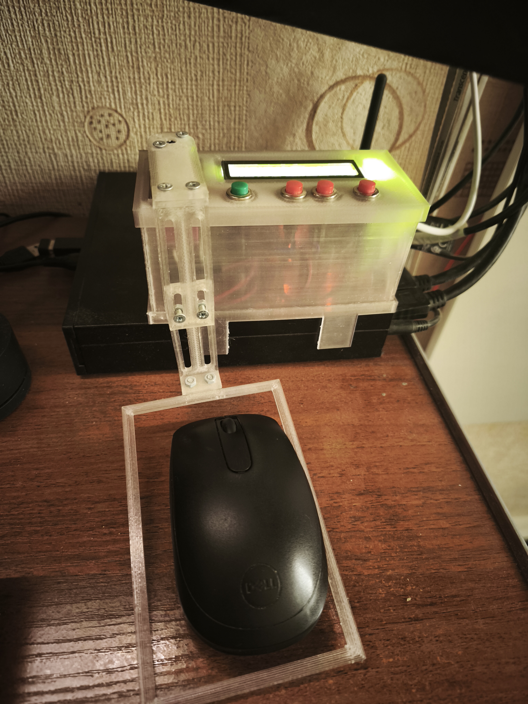
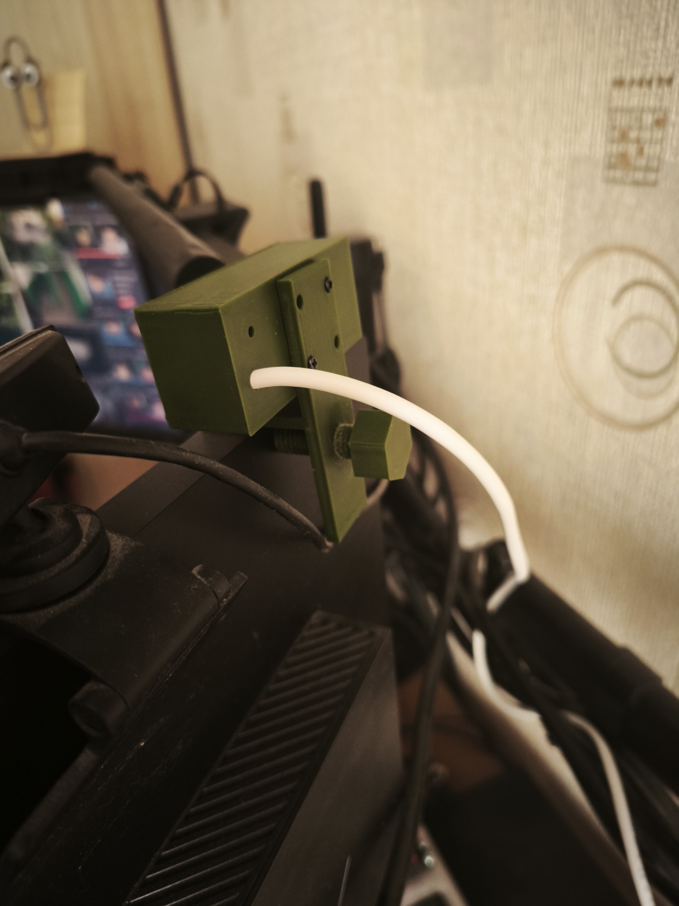
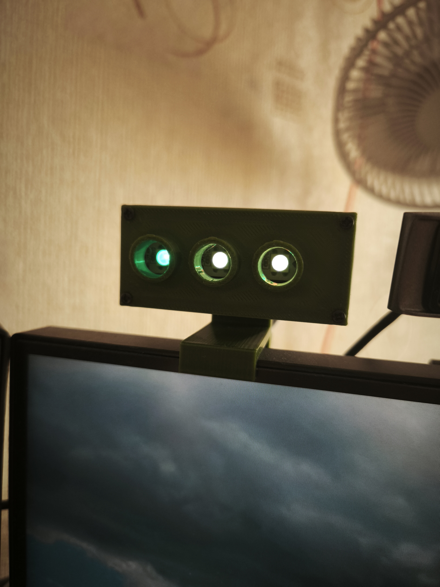
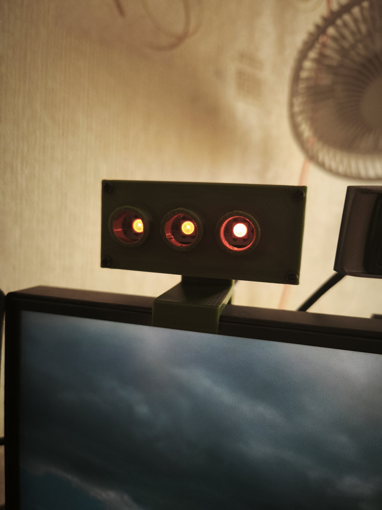
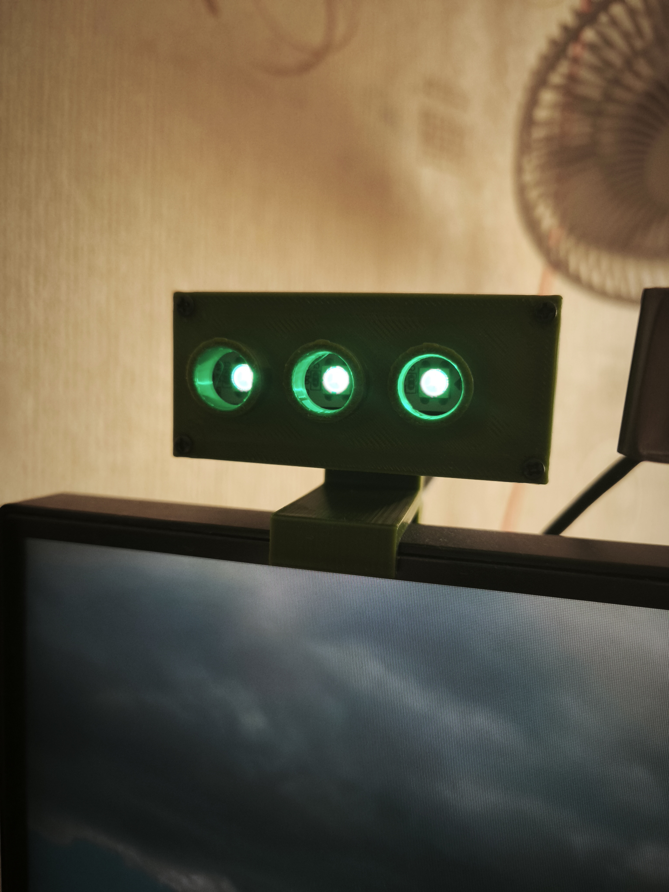
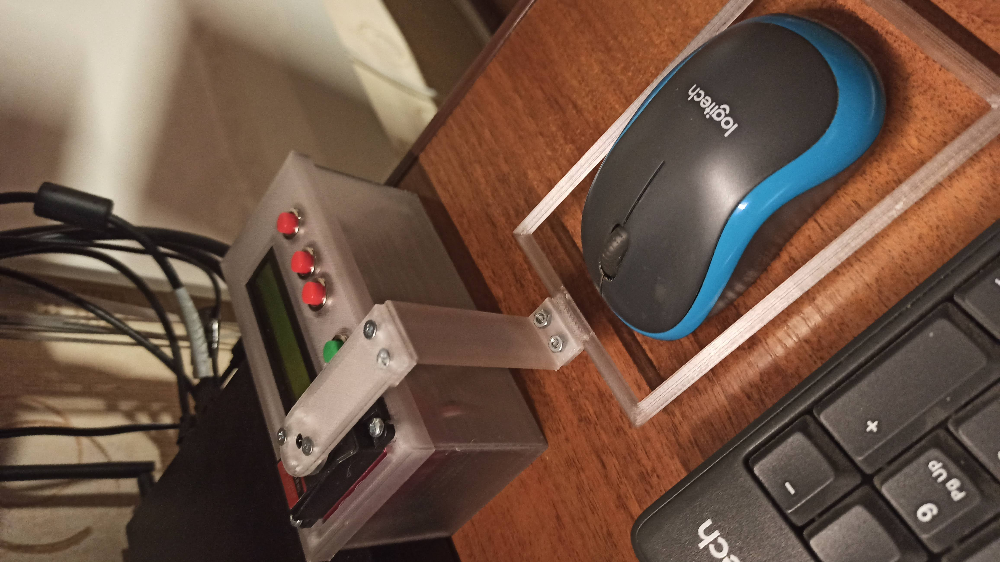
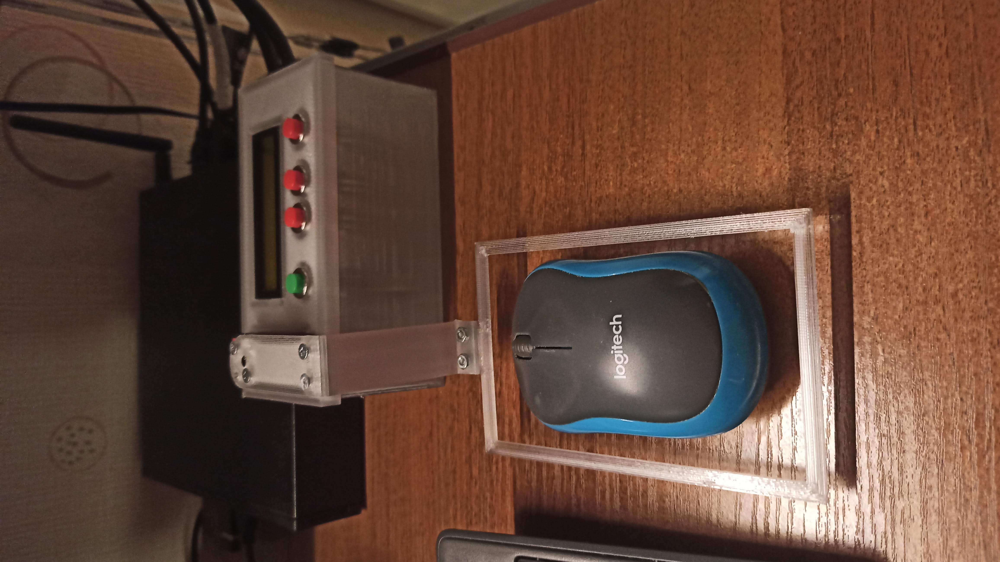
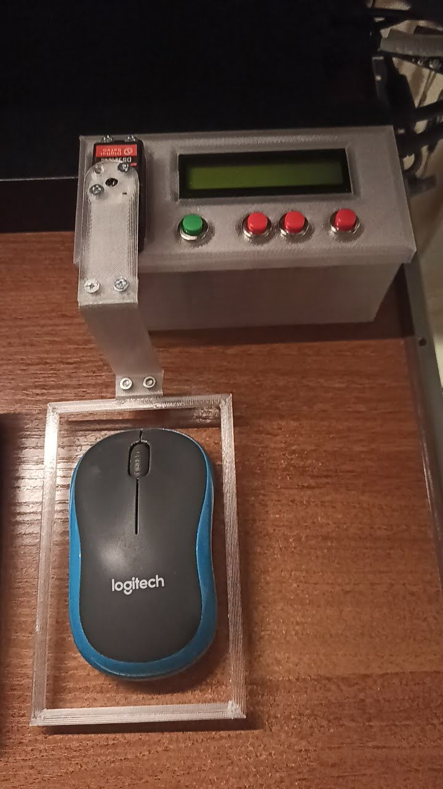

# AI Helper

ESP32 firmware that gives coding agents (Claude Code, GitHub Copilot, ...) a physical presence on the desk: an RGB **status semaphore** (LED + buzzer) that shows what the agent is currently doing, plus an optional **mouse mover** module to keep the workstation awake during long agent sessions.

Both modules share one ESPHome codebase and can be flashed together on one board or as two independent devices.

---

## Hardware

3D-printable enclosure parts are in [`stl/`](stl/):

- `MMBottom.stl` / `MMTop.stl` — mouse mover enclosure base and lid
- `MMHPart1.stl` .. `MMHPart4.stl`, `MMHPart2Long.stl` — mover arm/horn segments (use `MMHPart2Long.stl` instead of `MMHPart2.stl` for the extended-reach variant)
- `Semaphor - Holder.stl`, `Semaphor - Sem Bottom.stl`, `Semaphor - Sem Top.stl`, `Semaphor - Screw.stl` — semaphore enclosure parts
- `A1M AI-Helper.3mf` — combined 3MF project file for the semaphore parts

Common electronics for both modules:

- ESP32 dev board (esp-idf framework)
- Semaphore: WS2812 4-LED strip (`GPIO26`), passive buzzer via LEDC PWM (`GPIO25`, channel 2)
- Mouse mover: SG90-class servo (`GPIO23`, LEDC channel 0), 16x2 LCD over I2C (`GPIO21`/`GPIO22`, PCF8574 backpack), 4 push buttons (OK/Up/Down/Right), built-in blue status LED (`GPIO2`)

---

## Project layout

| File | Purpose |
|---|---|
| [`ai-helper.yaml`](ai-helper.yaml) | Combined build — both modules on one ESP32 (`ai-helper` device) |
| [`semaphore-device.yaml`](semaphore-device.yaml) | Standalone semaphore-only build (`ai-semaphore` device) |
| [`mouse-mover-device.yaml`](mouse-mover-device.yaml) | Standalone mouse-mover-only build (`mouse-mover` device) |
| [`ai-helper-common.yaml`](ai-helper-common.yaml) | Shared package: logger, OTA, time, WiFi/AP, captive portal, web server, `http_request`, WiFi RSSI sensor |
| [`ai-helper-defaults.yaml`](ai-helper-defaults.yaml) | Shared substitutions: brightness/buzzer ranges, color and LED-assignment option lists |
| [`ai-helper-semaphore.yaml`](ai-helper-semaphore.yaml) / [`.h`](ai-helper-semaphore.h) | Semaphore module: status LED, buzzer, per-status color/brightness/buzzer config, webhook buttons |
| [`ai-helper-mouse-mover.yaml`](ai-helper-mouse-mover.yaml) / [`.h`](ai-helper-mouse-mover.h) | Mouse mover module: servo sweep, LCD menu, random.org-seeded randomization |
| [`ai-helper-mouse-mover-defaults.yaml`](ai-helper-mouse-mover-defaults.yaml) | Mouse mover substitutions: pins, angle/step/delay ranges, timing |
| `secrets.yaml` | WiFi/MQTT credentials (not committed) |

Both device modules are compiled behind `platformio_options.build_flags` (`AI_HELPER_SEMAPHORE_BUILD_ENABLED`, `AI_HELPER_MOUSE_MOVER_BUILD_ENABLED`), so the combined `ai-helper.yaml` build includes both, while the two standalone `*-device.yaml` files enable only one flag and `!include` only the matching package.

---

## Semaphore module

Shows the AI agent's current phase via an RGB LED (one of 3 physical positions: Red/Yellow/Green segment) and an optional buzzer beep.

Status states: `Idle`, `Reasoning`, `Done`, `Need User Action`, `Allow Action`, `Custom1`, `Custom2`. Each status has independently configurable LED color, LED position, brightness, and buzzer (enabled/frequency/volume/repeat) — all exposed as Home Assistant `number`/`select`/`switch` config entities.

Status can be changed:

- From Home Assistant, via the `AI Status` select entity
- Over the native API, via the `set_ai_status` action (also `claude_status_hook` / `copilot_status_hook`, kept as aliases)
- Over HTTP, by POSTing to the ESPHome web server's button-press REST endpoint (this is what the [Webhook setup](#webhook-setup-for-claude-code-and-copilot) below uses):

  ```
  POST http://<device-ip>/button/webhook_<status>/press
  ```

  where `<status>` is one of `idle`, `reasoning`, `done`, `need_user_action`, `allow_action`, `custom1`, `custom2`.

## Mouse mover module

Sweeps a servo horn back and forth on a timer to simulate mouse activity, with an LCD showing live state and physical buttons for setup.

- Configurable start/end/max angle, step size, step delay, and sweep period, each with min/max bounds enforced via the `number` entities
- `Use random.org` switch: when enabled, refreshed values (angle/step/delay/period) are pulled from random.org over HTTPS; falls back to local pseudo-random values on request failure or when offline
- LCD menu: short-press OK/Right for quick actions, long-press to toggle enable; Up/Down enter a bound-editing mode to set start/end angle live from the servo's current position
- Compile-time disable via `AI_HELPER_MOUSE_MOVER_BUILD_ENABLED=0` still allows the runtime switch to exist but forces it off

---

## Webhook setup for Claude Code and Copilot

The semaphore exposes one HTTP endpoint per status via ESPHome's built-in web server (`web_server: port: 80`, enabled in [`ai-helper-common.yaml`](ai-helper-common.yaml)). No Home Assistant is required for this — coding-agent hooks call the device directly over HTTP on the LAN:

```
POST http://<device-ip>/button/webhook_<status>/press
```

Replace `<device-ip>` with the semaphore's IP (find it in your router/DHCP leases, or use the ESPHome dashboard). This repo's example scripts point at `172.16.1.15`.

### Available webhook statuses

These endpoints exist regardless of which agent calls them:

| Endpoint | Resulting status | When to trigger it |
|---|---|---|
| `POST /button/webhook_idle/press` | `Idle` | Reset/clear, no active session |
| `POST /button/webhook_reasoning/press` | `Reasoning` | Agent starts active work: reading, planning, editing, compiling, testing, debugging |
| `POST /button/webhook_need_user_action/press` | `Need User Action` | Agent needs missing info, manual verification, flashing, physical checks, or secrets from the user |
| `POST /button/webhook_allow_action/press` | `Allow Action` | Agent needs approval for a risky/consequential action, or permission to read outside the workspace |
| `POST /button/webhook_done/press` | `Done` | Requested work is complete and the agent is about to send its final response |
| `POST /button/webhook_custom1/press` | `Custom1` | Free-form, project-defined use |
| `POST /button/webhook_custom2/press` | `Custom2` | Free-form, project-defined use |

Both agent integrations below just decide *when* to hit which of these endpoints.

### Claude Code

Claude Code hooks are configured in [`.claude/settings.json`](../.claude/settings.json) and shell out to [`.github/hooks/ai-helper-status-sync.ps1`](../.github/hooks/ai-helper-status-sync.ps1), which POSTs to the semaphore and de-dupes repeated calls to the same status via a temp state file.

1. Confirm the semaphore IP in `.github/hooks/ai-helper-status-sync.ps1` (`$uri` line) matches your device.
2. Wire hook events to a `-Mode` in `.claude/settings.json`:

   | Claude Code hook | `-Mode` | Resulting status |
   |---|---|---|
   | `UserPromptSubmit`, `PostToolUse` | `reasoning` | `Reasoning` |
   | `PreToolUse` (matcher: `AskUserQuestion\|ExitPlanMode`) | `need_user_action` | `Need User Action` |
   | `PermissionRequest` | `allow_action` | `Allow Action` |
   | `Notification` (matcher: `Task completed\|Done`) | `done` | `Done` |
   | `Stop` | `classify-stop` | inferred from the final assistant message (see below) |

3. `classify-stop` mode reads the hook JSON payload from stdin, extracts the last assistant message, and pattern-matches it: mentions of asking permission → `Allow Action`, mentions of a manual step needed from the user → `Need User Action`, otherwise → `Done`.
4. The script is defensive by design — any HTTP failure is swallowed so a semaphore outage never blocks an agent turn.

### GitHub Copilot

The equivalent hook wiring lives in [`.github/hooks/status-sync.json`](../.github/hooks/status-sync.json) (`UserPromptSubmit` → `reasoning`, `PreToolUse` → `need_user_action`, `AllowAction` → `allow_action`, `Done` → `done`, `Stop` → `classify-stop`), calling the same `ai-helper-status-sync.ps1` script. [`.github/copilot-instructions.md`](../.github/copilot-instructions.md) additionally instructs Copilot to call the webhooks directly via `curl.exe` as part of its normal workflow:

```cmd
curl.exe -s -o NUL -X POST -d "" "http://172.16.1.15/button/webhook_reasoning/press"
curl.exe -s -o NUL -X POST -d "" "http://172.16.1.15/button/webhook_need_user_action/press"
curl.exe -s -o NUL -X POST -d "" "http://172.16.1.15/button/webhook_allow_action/press"
curl.exe -s -o NUL -X POST -d "" "http://172.16.1.15/button/webhook_done/press"
curl.exe -s -o NUL -X POST -d "" "http://172.16.1.15/button/webhook_idle/press"
```

To point either integration at your own device, replace `172.16.1.15` everywhere it appears (`ai-helper-status-sync.ps1` and `copilot-instructions.md`) with your semaphore's actual IP address.

---

## Build / Flash

```cmd
cd d:\esphome\ai-helper
esphome run ai-helper.yaml
```

Or flash a single module only:

```cmd
esphome run semaphore-device.yaml
esphome run mouse-mover-device.yaml
```

Config-only validation:

```cmd
esphome config ai-helper.yaml
```

## Required secrets

`secrets.yaml` in this folder (not committed):

```yaml
wifi_ssid: "Your_SSID"
wifi_password: "Your_WiFi_Password"
```

---

## Photos


















Mouse mover in action: [`VID_20240801_203023.mp4`](photo/VID_20240801_203023.mp4), [`VID_20240801_203426.mp4`](photo/VID_20240801_203426.mp4)
