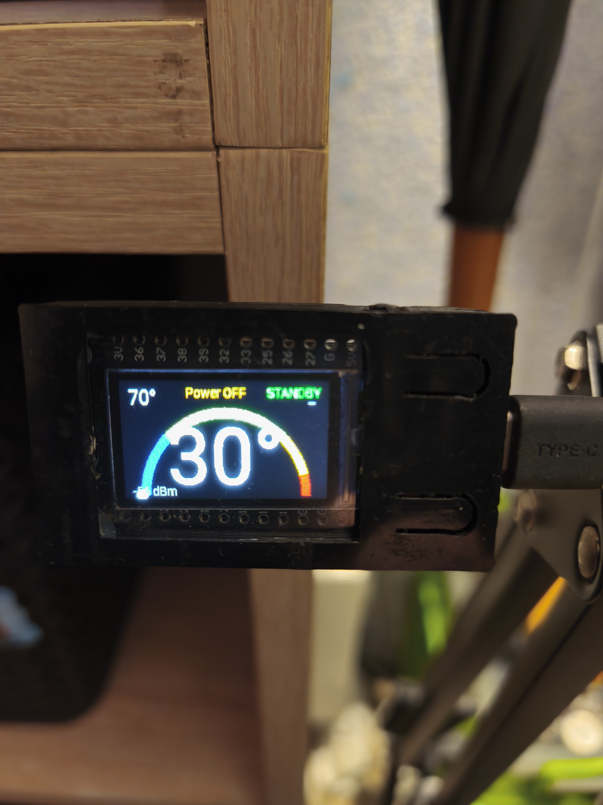
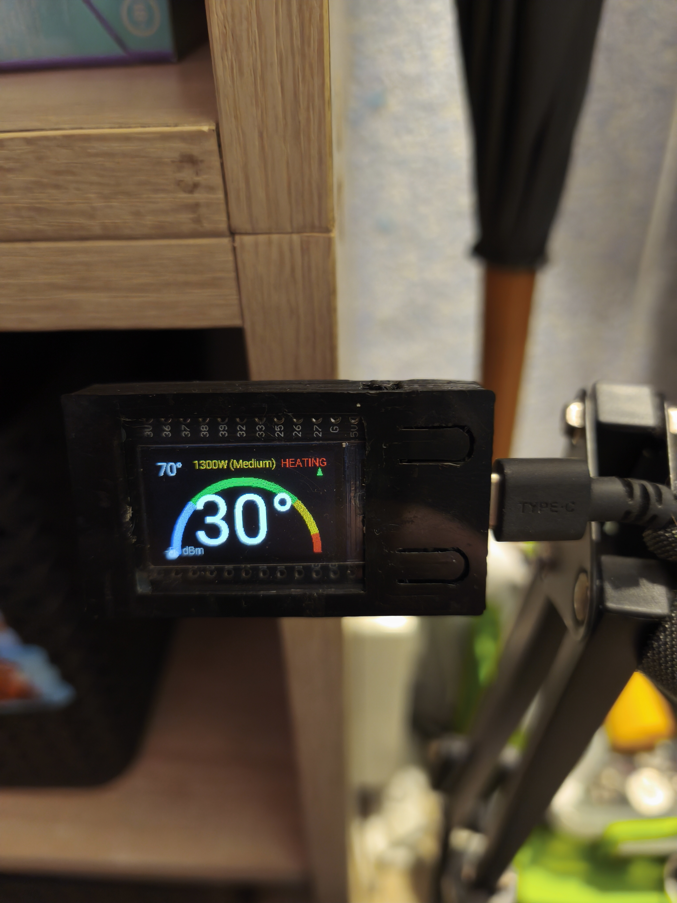

# Electrolux Boiler LCD (ESPHome)

ESPHome configuration for an **ESP32 + TTGO T-Display (ST7789 135x240)** acting as a small wall/display panel for an Electrolux boiler, showing boiler state via **MQTT**.

This project is intended to be used alongside a boiler integration that publishes values to MQTT topics (current temperature, target temperature, heating state, mode, etc.). The ESP32 subscribes to those topics and renders the data on the LCD.

## Photos

| Device | Wiring / setup |
|---|---|
|  |  |

## Features

- ESPHome on **ESP32**
- **TTGO T-Display 135x240** (ST7789v) screen rendering
- Screen backlight control (PWM) with:
  - brightness slider in Home Assistant (template number)
  - physical button cycling brightness
- Auto screen timeout (turn off backlight after configurable time)
- Optional screen rotation toggle button
- Wi‑Fi captive portal fallback AP
- MQTT subscribe-based updates + optional boiler debug log subscription

## Project structure

- `electrolux-boiler-LCD.yaml` — main ESPHome configuration
- `electrolux-boiler-lcd.h` — LCD rendering / helper logic (C++ includes)
- `electrolux-boiler-lcd-defines.h` — constants / defines
- `test.yaml` — minimal/test config
- `images/` — photos used in this README

## Hardware

Tested/target hardware (as configured):

- ESP32 dev board (TTGO T-Display style)
- Display: **ST7789v**, model: `TTGO_TDISPLAY_135X240`
- Backlight pin: `GPIO33` (as configured in ESPHome display component)
- Backlight PWM output pin: `GPIO4` (via `ledc` output)
- Buttons:
  - Left button: `GPIO0` (input pullup, inverted)
  - Right button: `GPIO35` (inverted)

## MQTT topics used

This configuration subscribes to boiler state topics (published by your boiler controller/integration). By default it expects topics like:

- `boiler/sensor/boiler_current_temp/state`
- `boiler/sensor/boiler_target_temp/state`
- `boiler/binary_sensor/boiler_heating/state`
- `boiler/sensor/boiler_power_mode/state`
- `boiler/binary_sensor/boiler_bst_mode/state`
- `boiler/sensor/boiler_temp_trend/state`

Optional debug subscription:

- `boiler/debug` (only useful if your boiler publishes logs there)

> Note: The YAML uses `topic_prefix: boiler/lcd` for the LCD device’s own MQTT entities.

## Configuration

### 1) Copy files

Copy the whole `electrolux-boiler-lcd/` folder into your ESPHome config directory, or reference the YAML directly in your repo setup.

### 2) Set secrets

In `secrets.yaml`, define:

```yaml
mqtt_broker: 192.168.1.10
mqtt_username: your_user
mqtt_password: your_pass
```

### 3) Adjust substitutions (optional)

At the top of `electrolux-boiler-LCD.yaml`:

- `device_name` — node name
- `screen_timeout` — how long the backlight stays on after “wake” events (default `60s`)

### 4) Flash

Compile and flash as usual with ESPHome.

## Home Assistant entities

The config exposes (among others):

- **Display Switch** (monochromatic light): turns LCD backlight on/off
- **Display Brightness** (template number slider): 0.1 → 1.0
- **Toggle Landscape Rotation** (template button): toggles rotation (calls `lcd_toggle_rotation()` in the C++ code)
- **Reset Device WiFi** (factory reset button)
- **WiFi Signal Sensor**

## Notes / troubleshooting

- If the screen isn’t updating, confirm:
  - MQTT broker is reachable
  - the boiler topics match what your boiler integration publishes
- If the display is mirrored/rotated incorrectly, use the rotation toggle (or adjust `rotation` and related logic).
- If the screen never turns off, check `wake_screen_script` and `screen_timeout`.

## License

Add a license if you plan to share/redistribute this project.
