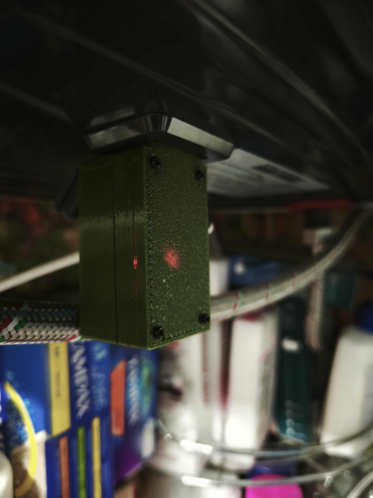
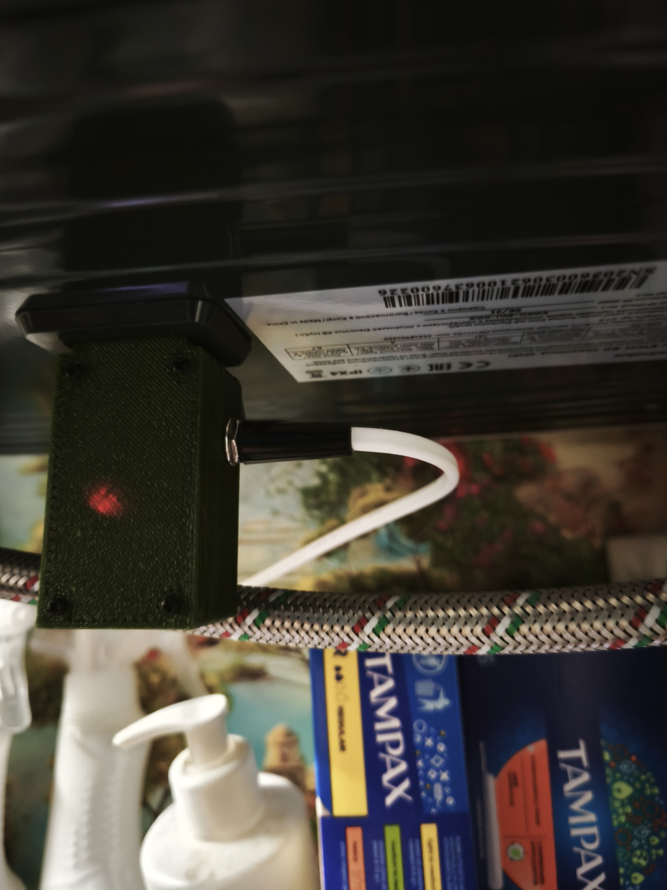
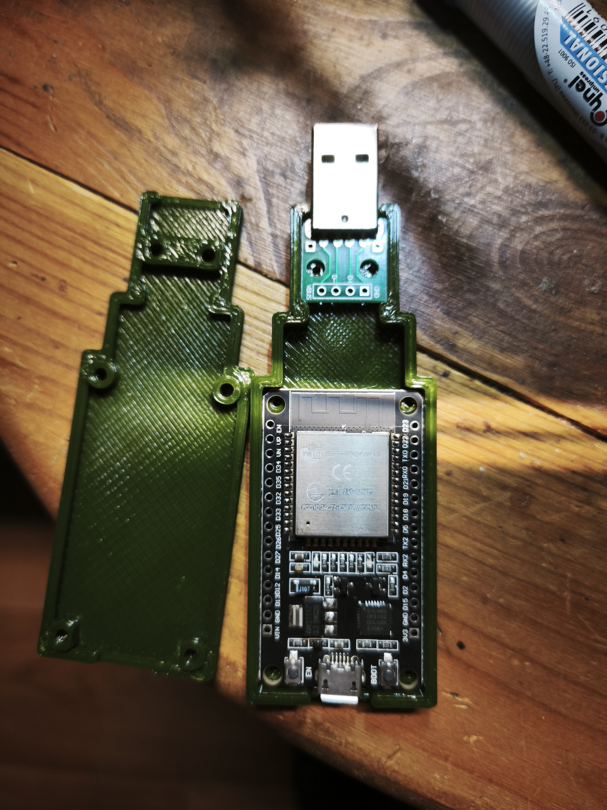
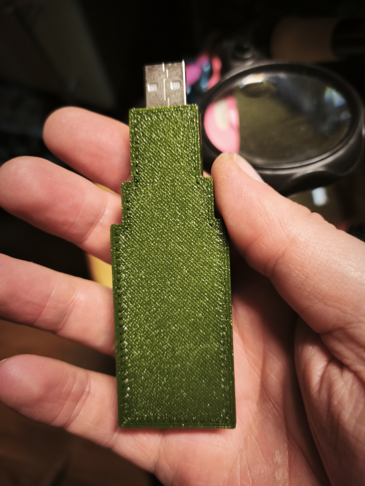
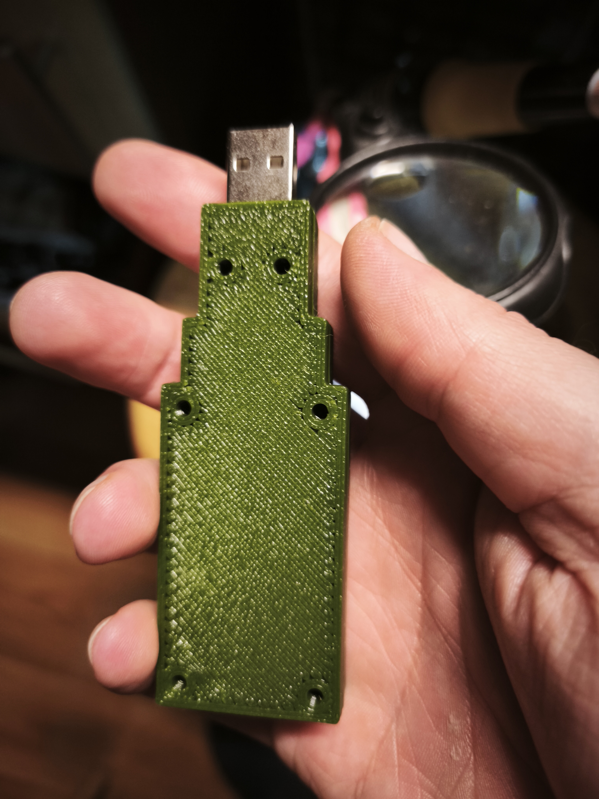

# Electrolux Boiler (ESPHome + ESP32)

ESPHome configuration and 3D-printable enclosure parts for integrating an Electrolux boiler with Home Assistant (via MQTT / API) using an ESP32 and a UART connection.

> 💡 **Standalone monitoring without grid power:** The ESP32 can be powered independently via its **5 V USB pin** (as shown in the wiring photos). When the boiler has no mains power (grid outage, circuit breaker off, etc.), the boiler's internal controller — including its relay, thermostat, and temperature sensor — continues to operate on its own low-voltage supply. The ESP32 will still receive UART status packets and can report **current water temperature** to Home Assistant even with no grid power to the heating element.

---

## Files

| Path | Description |
|------|-------------|
| `electrolux-boiler.yaml` | ESPHome firmware configuration |
| `electrolux-boiler-defines.h` | Protocol constants, mode map, thresholds |
| `electrolux-boiler.h` | C++ logic: packet builders, parsers, helpers |
| `secrets.yaml` | WiFi / MQTT credentials (not committed) |
| `images/` | Wiring photos and UI screenshots |
| `stl/` | 3D-printable enclosure models |

---

## ESPHome Configuration

### Board & Framework

| Setting | Value |
|---------|-------|
| Board | `esp32dev` |
| Framework | `esp-idf` |

### Connectivity

| Feature | Details |
|---------|---------|
| WiFi | Credentials via `secrets.yaml`; fallback AP `AP-Boiler` + captive portal |
| Web server | Port 80 |
| Home Assistant API | Enabled |
| MQTT | Broker/user/pass via secrets; topic prefix `boiler`; MQTT discovery enabled |
| NTP | `sntp` time platform, timezone `Europe/Kyiv` (configurable via substitution) |

### UART (Boiler communication)

| Pin | Direction | Notes |
|-----|-----------|-------|
| `GPIO17` (TX) | ESP32 → Boiler RX | ~1.7 V logic level (White/Blue, USB−) |
| `GPIO16` (RX) | Boiler TX → ESP32 | ~5.0 V logic level (Green, USB+) |
| Baud rate | 9600 | 8N1, packet size 13 bytes |

> ⚠️ The boiler TX line is at 5 V. Use appropriate level shifting to protect the ESP32.

### Sensors

| Name | Type | Unit | Notes |
|------|------|------|-------|
| Boiler Current Temp | Sensor | °C | Live water temperature |
| Boiler Target Temp | Sensor | °C | Target set on boiler |
| Boiler Power | Sensor | W | Nominal draw when heating, 0 otherwise |
| Boiler Total Energy | Sensor | kWh | Cumulative, `total_increasing` — use in HA Energy Dashboard |
| WiFi Signal | Sensor | dBm | Sampled every 30 s |
| Boiler Heating | Binary sensor | — | `heat` device class; true when cur_t ≤ tar_t − threshold |
| Boiler BST Mode | Binary sensor | — | Bacteria Stop Technology active |
| Online Status | Binary sensor | — | Connected to WiFi/MQTT |
| Boiler Temp Trend | Text sensor | — | `Up` / `Down` / `Stable` (ring buffer, 2–4 samples) |
| Boiler Power Mode | Text sensor | — | e.g. `1300W (Medium)`, `Timer`, `No Frost 5°C` |
| Boiler Clock | Text sensor | `HH:MM` | Boiler's internal clock (synced from NTP) |
| Boiler Timer Start Time | Text sensor | `HH:MM` | Scheduled start time echoed back from boiler |
| Boiler Raw Packet Dec | Text sensor | — | Internal debug — raw RX bytes (decimal) |

### Controls

| Name | Type | Options / Range |
|------|------|-----------------|
| Boiler Main Power | Switch | On / Off |
| Boiler BST Mode | Switch | On / Off (Bacteria Stop Technology) |
| Boiler Power Mode Set | Select | `700W (Low)` · `1300W (Medium)` · `2000W (High)` · `Timer` · `No Frost 5°C` |
| Boiler Target Temp Set | Number (slider) | 35 °C – 75 °C, step 1 |
| Boiler Timer Start Hour | Number (box) | 0 – 23, step 1 |
| Boiler Timer Start Minute | Number (box) | 0 – 55, step 5 |
| Sync Boiler Clock | Button | Sends current NTP time to boiler |
| Run Boiler Timer | Button | Syncs clock → sends timer start packet → requests state |
| Reset Device WiFi | Button | Factory reset (WiFi credentials) |
| Boiler Raw Command | Text input | Send raw decimal packet, prefix `C:` to auto-append checksum |

### Timer Mode

The timer is a **scheduled start time** (not a countdown). When activated:
1. Boiler clock is synced to NTP (`Sync Boiler Clock`)
2. Timer packet is sent with the configured `HH:MM` start time
3. State is requested immediately — boiler should report mode = `Timer` (4) to confirm

The boiler will start heating at the scheduled clock time using the current target temperature.

### Energy Tracking

- **Boiler Power** reflects the element's rated wattage (700 / 1300 / 2000 W) while `is_heating` is true
- **Boiler Total Energy** accumulates Wh every 30 s and survives reboots (`restore_value: true`)
- Add **Boiler Total Energy** to the HA Energy Dashboard under *Settings → Energy → Individual devices*

### Protocol Reference

- All packets: `AA [len] [data…] [CS]` — CS = sum of all preceding bytes (uint8)
- TX write command `0x0A`: sub-commands `0`=mode, `1`=clock, `2`=timer, `3`=BST
- RX status packet `0x09` / `0x88`: 13 bytes, 30 s cadence
- Reference: [dentra/esphome-ewh — reverse.md](https://github.com/dentra/esphome-ewh/blob/master/reverse.md)

---

## Images

### Hardware / Wiring







### Home Assistant UI


---

## 3D-Printable Enclosure

Folder: [`stl/`](stl/)

The enclosure is designed for an **ESP32 WROOM DevKit** module.

| File | Description |
|------|-------------|
| `BoilerStick.3mf` | Complete project file (Bambu / PrusaSlicer) |
| `BoilerStickElectroluxESP32Wroom - Top.stl` | Enclosure top half |
| `BoilerStickElectroluxESP32Wroom - Bottom.stl` | Enclosure bottom half |
| `BoilerStickElectroluxESP32Wroom - PS.stl` | Power supply bracket |
| `BoilerStickElectroluxESP32Wroom - Bottom + PS.stl` | Bottom + power supply bracket combined |

**Printing tips:**
- Material: PETG or ABS recommended (heat / humidity environment)
- Add supports as needed depending on orientation

---

## Quick Setup

1. **Copy secrets** – create / extend `secrets.yaml`:
   ```yaml
   mqtt_broker: <your_broker_ip>
   mqtt_username: <username>
   mqtt_password: <password>
   wifi_ssid: <your_ssid>
   wifi_password: <your_wifi_password>
   ```
2. **Flash** – compile and flash `electrolux-boiler.yaml` to the ESP32.
3. **Wire** – connect UART as described above (add level shifting on the RX line).
4. **Home Assistant** – entities appear automatically via MQTT discovery.
5. **Energy Dashboard** – add **Boiler Total Energy** sensor under *Settings → Energy → Individual devices*.
6. **Fallback** – if WiFi is unavailable, connect to AP `AP-Boiler` (password: `password`) and configure via captive portal or web UI at `192.168.4.1`.

---

## Links

- [dentra/esphome-ewh](https://github.com/dentra/esphome-ewh) — protocol reverse engineering reference
- [ESPHome UART Debug](https://esphome.io/components/uart.html#uart-debug-component)
- Config: [`electrolux-boiler.yaml`](electrolux-boiler.yaml)
- Images: [`images/`](images/)
- Models: [`stl/`](stl/)
