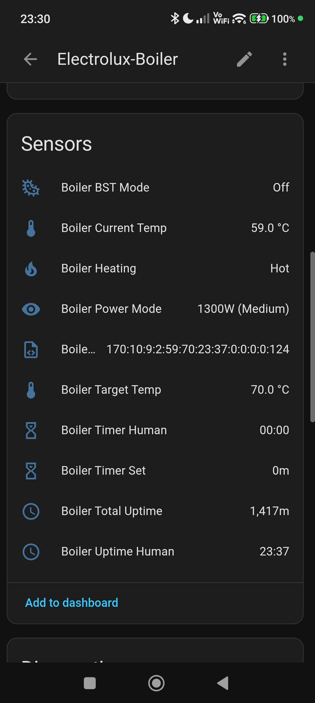

# Electrolux Boiler (ESPHome + ESP32)

ESPHome configuration and 3D-printable enclosure parts for integrating an Electrolux boiler with Home Assistant (via MQTT / API) using an ESP32 and a UART connection.

---

## Files

| Path | Description |
|------|-------------|
| `electrolux-boiler.yaml` | ESPHome firmware configuration |
| `images/` | Wiring photos and UI screenshots |
| `stl/` | 3D-printable enclosure models |

---

## ESPHome Configuration

Main config: [`electrolux-boiler.yaml`](electrolux-boiler.yaml)

### Board & Framework

| Setting | Value |
|---------|-------|
| Board | `esp32dev` |
| Framework | `esp-idf` |

### Connectivity

| Feature | Details |
|---------|---------|
| WiFi | Credentials via secrets; fallback AP `AP-Boiler` + captive portal |
| Web server | Port 80 |
| Home Assistant API | Enabled |
| MQTT | Broker/user/pass via secrets; topic prefix `boiler`; discovery enabled |

### UART (Boiler communication)

| Pin | Direction | Notes |
|-----|-----------|-------|
| `GPIO17` (TX) | ESP32 → Boiler RX | ~1.7 V logic level (White/Blue, USB−) |
| `GPIO16` (RX) | Boiler TX → ESP32 | ~5.0 V logic level (Green, USB+) |
| Baud rate | 9600 | 8N1 |

> ⚠️ The boiler TX line is at 5 V. Use appropriate level shifting to protect the ESP32.

### Sensors

| Name | Type | Unit |
|------|------|------|
| Boiler Current Temp | Sensor | °C |
| Boiler Target Temp | Sensor | °C |
| Boiler Total Uptime | Sensor | min |
| Boiler Timer Set | Sensor | min |
| WiFi Signal | Sensor | dBm |
| Boiler Heating | Binary sensor | heat class |
| Boiler BST Mode | Binary sensor | (Bacteria Stop Technology) |
| Boiler Power Mode | Text sensor | e.g. `1300W (Medium)` |
| Boiler Uptime Human | Text sensor | `HH:MM` |
| Boiler Timer Human | Text sensor | `HH:MM` |
| Boiler Raw Packet Dec | Text sensor | raw debug bytes |

### Controls

| Name | Type | Options / Range |
|------|------|-----------------|
| Boiler Main Power | Switch | On / Off |
| Boiler Power Mode Set | Select | 700W (Low) · 1300W (Medium) · 2000W (High) |
| Boiler Target Temp Set | Number (slider) | 35 °C – 75 °C, step 1 |
| Handshake | Button | Sends handshake packet `[0xBB, 0x00, 0x01, 0x00, 0x02]` |

---

## Images

### Hardware / wiring


### Home Assistant UI




---

## 3D-Printable Enclosure

Folder: [`stl/`](stl/)

The enclosure is designed for an **ESP32 WROOM DevKit** module.

| File | Description |
|------|-------------|
| `BoilerStick.3mf` | Complete project file (Bambu/PrusaSlicer) |
| `BoilerStickElectroluxESP32Wroom - Top.stl` | Enclosure top half |
| `BoilerStickElectroluxESP32Wroom - Bottom.stl` | Enclosure bottom half |
| `BoilerStickElectroluxESP32Wroom - PS.stl` | Power supply bracket |
| `BoilerStickElectroluxESP32Wroom - Bottom + PS.stl` | Bottom + power supply bracket combined |

**Printing tips:**
- Material: PETG or ABS recommended (heat / humidity environment)
- Add supports as needed depending on orientation

---

## Quick Setup

1. **Copy secrets** – create a `secrets.yaml` (or add to your existing one):
   ```yaml
   mqtt_broker: <your_broker_ip>
   mqtt_username: <username>
   mqtt_password: <password>
   wifi_ssid: <your_ssid>
   wifi_password: <your_wifi_password>
   ```
2. **Flash** – compile and flash `electrolux-boiler.yaml` to the ESP32.
3. **Wire** – connect UART as described above (add level shifting on the RX line).
4. **Home Assistant** – entities appear automatically via MQTT discovery.
5. **Fallback** – if WiFi is unavailable, connect to AP `AP-Boiler` (password: `password`) and configure via captive portal or web UI at `192.168.4.1`.

---

## Links

- Config: [`electrolux-boiler/electrolux-boiler.yaml`](electrolux-boiler.yaml)
- Images: [`electrolux-boiler/images/`](images/)
- Models: [`electrolux-boiler/stl/`](stl/)
