# Garage Generator Controller

ESPHome configuration for an ESP32-based generator controller with power monitoring, relay outputs, RF learn/transmit, LCD status, Home Assistant integration, and a mirrored choke-servo pair built from two DS3230 Pro 30 kg 270 degree servos.

## YAML layout

The device config is intentionally split into focused package files:

- `garage-generator.yaml`: base device identity, Wi-Fi/API/logger, globals, relays, physical and HA action buttons, core sensors, and high-level action scripts.
- `garage-generator-rf.yaml`: RF receiver/transmitter pins and tuning, persisted raw RF storage, learn/test/reset buttons, RF raw text sensors, and RF send/assign scripts.
- `garage-generator-servos.yaml`: servo pins and PWM parameters, servo switches/buttons/numbers, persisted servo positions, and servo movement scripts.
- `garage-generator-mqtt.yaml`: broker settings plus explicit `cmd`, `tele`, and `stat` topics.
- `garage_generator_logic.h`: shared runtime helpers used by the YAML lambdas.

## Screenshots

## Implemented behavior (current)

- PZEM telemetry is polled every 2 seconds and published with staggered per-sensor throttles by priority.
- Running-state detection uses both voltage threshold and PZEM freshness checks.
- Stale PZEM values are actively zeroed (voltage/current/power/frequency/power factor) instead of staying `unknown`.
- `Motor Hours` is accumulated only while running and supports `Motor Hours Offset`.
- `Last Run Start`, `Last Run Stop`, `Last Run Duration`, and `Current Run Duration` are exposed as text sensors.
- `Last Run Duration` and `Current Run Duration` are displayed as `HH:MM` (no seconds).
- `Current Run Duration` updates every 60 seconds and also refreshes on run-state transitions.
- If the device restarts while already running, current run duration is resumed from the preserved run start timestamp.
- Physical GPIO buttons are gated by `Physical Buttons Enabled` and default to OFF for safe bring-up.
- RF learn/capture is accepted only when learn mode is active.
- RF receive handling is controlled by `Generator RF Receiver Enabled` (OFF blocks capture handling to reduce noise).
- RF raw text sensors publish on boot and when a stored RF payload changes.
- Each learned RF raw payload now has its own reset button in Home Assistant, in addition to the full `Reset RF Codes` action.
- LCD update interval is slowed for lower runtime pressure.
- LCD line 2 no longer rotates automatically; short Settings press cycles line 2 view (V/P <-> I/PF).
- When fallback AP mode is active (captive portal), LCD line 2 shows `AP:<ssid>`.
- API queue sizing is tuned, while batch delay is left at the YAML/default behavior.
- MQTT auto-published entities are disabled (`topic_prefix: null`, `discovery: false`); only explicit `cmd` and `tele` topics are used.
- MQTT behavior is runtime-controlled from HA by `Generator MQTT Enabled` (no recompile required).
- Servo manual controls are exposed as `Run Servos`, `Servos To Start`, `Servos To Stop`, `Move Left Servo To Angle`, and `Move Right Servo To Angle`.
- `Move ... Servo To Angle` buttons use target angle clamped only by hardware max angle (`servo_max_angle_deg`), not by saved Start/Stop range.
- Servo saved range summary is exposed by one combined text sensor: `Generator Servo Start Stop Values`.
- `Generator Servo Start Stop Values` is refreshed on boot and when `Save Values As Start Position` or `Save Values As Stop Position` is pressed.

## Hardware summary

- ESP32 DevKit
- PZEM-004T V3.0 on UART2
- 4-channel active-low relay module
- 433.92 MHz ASK pair: SYN480R receiver and FS1000A/SYN115-class transmitter
- Two DS3230 Pro 30 kg 270 degree servos used as mirrored choke servos
- Servo pulse range configured for DS3230 Pro 270 degree travel: 500us to 2500us at 50 Hz (`2.5%` to `12.5%`)
- 16x2 LCD over PCF8574 I2C backpack
- DHT22 sensor
- Five physical buttons

| Function | GPIO |
| :--- | :--- |
| Relay 1 | 5 |
| Relay 2 | 18 |
| Relay 3 | 19 |
| Relay 4 | 23 |
| LCD SDA | 21 |
| LCD SCL | 22 |
| PZEM RX | 16 |
| PZEM TX | 17 |
| RF RX | 27 |
| RF TX | 26 |
| Servo 1 | 12 |
| Servo 2 | 13 |
| DHT | 4 |
| Button 1 | 14 |
| Button 2 | 25 |
| Button 3 | 32 |
| Button 4 | 33 |
| Button 5 | 35 |

## Home Assistant actions and entities

### Action buttons

- Action Stop / Stop Long
- Action Eco On / Eco Long
- Action Start / Start Long
- Action Rollete / Rollete Long
- Action Settings Short / Settings Long
- Run Servos
- Servos To Start
- Servos To Stop
- Move Left Servo To Angle
- Move Right Servo To Angle
- Save Values As Start Position
- Save Values As Stop Position

### Config and operational entities

- `Generator Use RF`
- `Generator RF Receiver Enabled`
- `Generator MQTT Enabled`
- `Generator Use Servos`
- `Generator Servo On <Action> Action` switches
- `Generator Physical Buttons Enabled`
- Timeout number fields for Stop/Eco/Start/Rollete (`-1` = relay toggle behavior)
- `Generator Motor Hours Offset`
- `Generator Reset Motor Hours`
- `Generator Reset All Counters`
- `Generator Reset RF Codes`
- `Generator Reset RF Raw Stop`
- `Generator Reset RF Raw Eco`
- `Generator Reset RF Raw Start`
- `Generator Reset RF Raw Rollete`

### Runtime/diagnostic entities

- PZEM: voltage/current/power/energy/frequency/power factor
	- Published with staggered throttles (Voltage 2s, Current 3s, Power 5s, Power Factor 7s, Frequency 11s, Energy 29s)
- DHT22: temperature/humidity
- `Generator Running`
- `Generator Motor Hours`
- `Generator Last Run Start`
- `Generator Last Run Stop`
- `Generator Last Run Duration`
- `Generator Current Run Duration`
- `Generator Servo Start Stop Values` (`Stop: Left/Right ; Start: Left/Right`)
- RF raw text sensors for Stop/Eco/Start/Rollete
- `Generator WiFi RSSI`

## MQTT contract

The device uses manual MQTT topics only.

- Runtime enable/disable:
	- `Generator MQTT Enabled` = ON: command handling + telemetry/status publishing active.
	- `Generator MQTT Enabled` = OFF: MQTT commands are ignored and custom telemetry/status publishing is paused.

- Commands:
	- `${device_name}/cmd/start` payload `PRESS`
	- `${device_name}/cmd/stop` payload `PRESS`
	- `${device_name}/cmd/eco` payload `PRESS`
	- `${device_name}/cmd/rollete` payload `PRESS`
	- `${device_name}/cmd/restart` payload `PRESS`
	- `${device_name}/cmd/wifi_reset` payload `PRESS`
	- `${device_name}/cmd/reset_rf_codes` payload `PRESS`
- Telemetry (published every 10 seconds when MQTT is connected):
	- `${device_name}/tele/voltage`
	- `${device_name}/tele/current`
	- `${device_name}/tele/power`
	- `${device_name}/tele/wifi_rssi`
	- `${device_name}/tele/current_run_duration`
- Relay/button state topics (published on every relay change, retained):
	- `${device_name}/stat/stop` -> `PRESSED`/`RELEASED`
	- `${device_name}/stat/eco` -> `PRESSED`/`RELEASED`
	- `${device_name}/stat/start` -> `PRESSED`/`RELEASED`
	- `${device_name}/stat/rollete` -> `PRESSED`/`RELEASED`

## RF learn flow

1. Enter learn mode from Settings long action (physical or HA action button).
2. Send remote RF signal.
3. Assign captured raw timing payload by long action for button 1, 2, 3, or 4.
4. Use RF action transmission occurs only when `Use RF` is ON and a raw payload is assigned.
5. Clear one stored payload with the matching `Reset RF Raw ...` button, or clear all four with `Reset RF Codes`.

## Operational notes from recent work

- If logs show `remote_receiver took a long time` together with `api.connection Buffer full`, treat it as receiver/API pressure first.
- Keep RF timing parameters conservative when tuning; aggressive decode settings can improve sensitivity but hurt correctness/stability.
- If OTA upload is unstable, use serial flashing fallback.
- GPIO5 and GPIO12 are strapping pins; treat external pull-up/down wiring carefully.

## Files

- Main config: [garage-generator.yaml](garage-generator.yaml)
- RF package: [garage-generator-rf.yaml](garage-generator-rf.yaml)
- Servo package: [garage-generator-servos.yaml](garage-generator-servos.yaml)
- MQTT package: [garage-generator-mqtt.yaml](garage-generator-mqtt.yaml)
- Runtime helper logic: [garage_generator_logic.h](garage_generator_logic.h)
- Requirements/spec notes: [requirements.md](requirements.md)

## Wiring Images

Additional wiring and hardware photos:

- 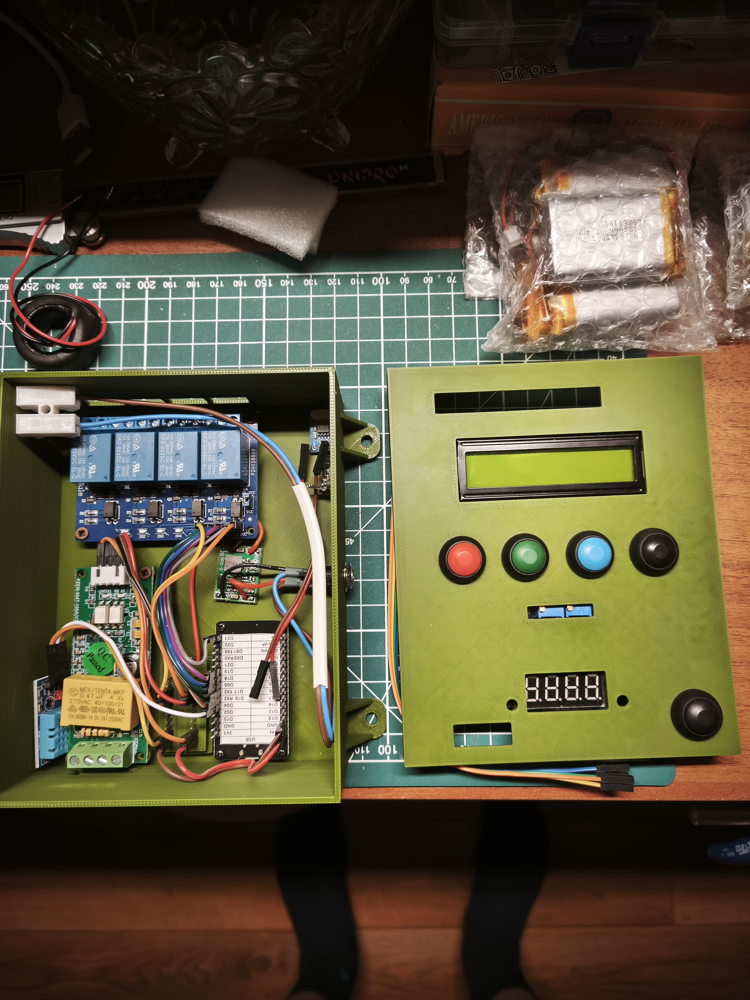
- 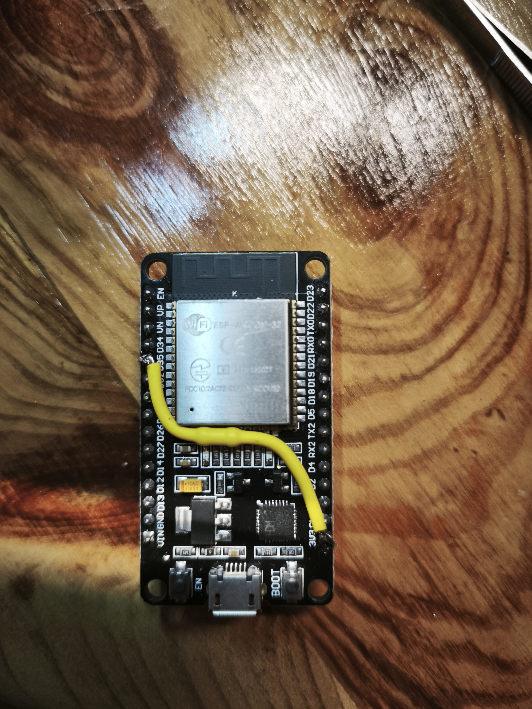
- 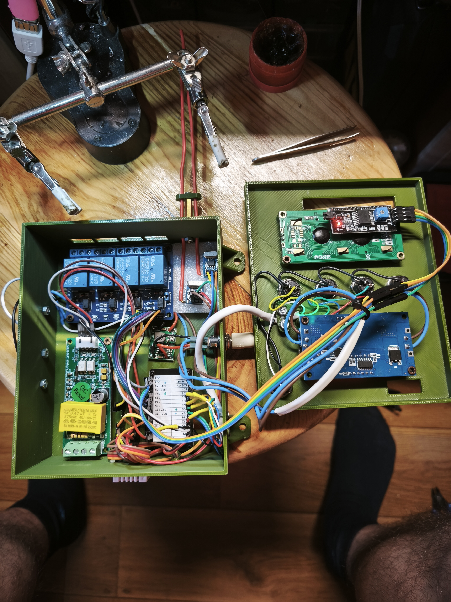
- 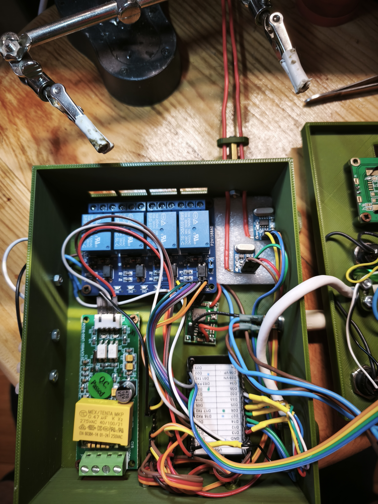
- 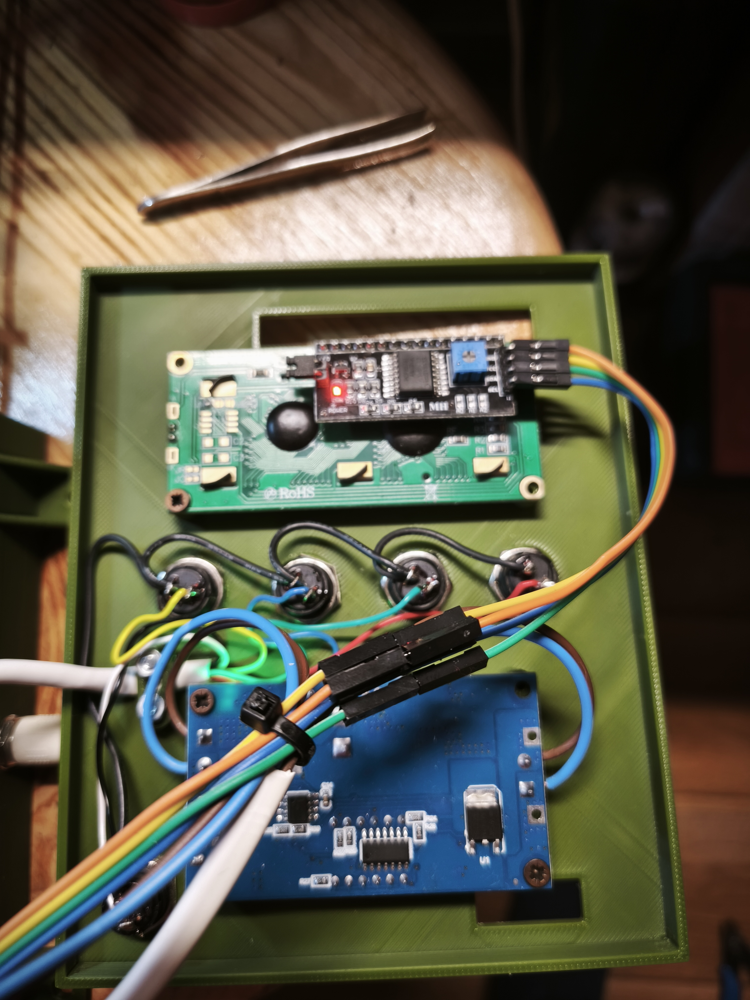
- 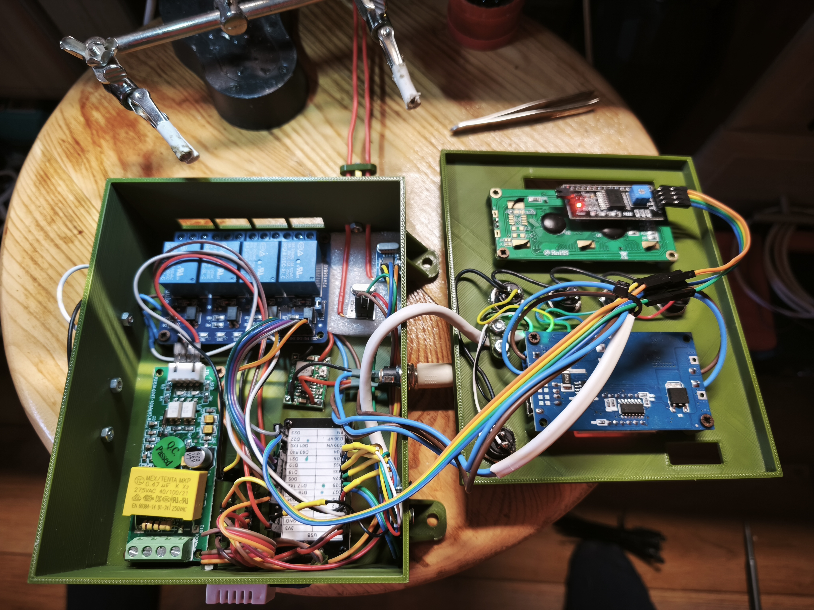
- 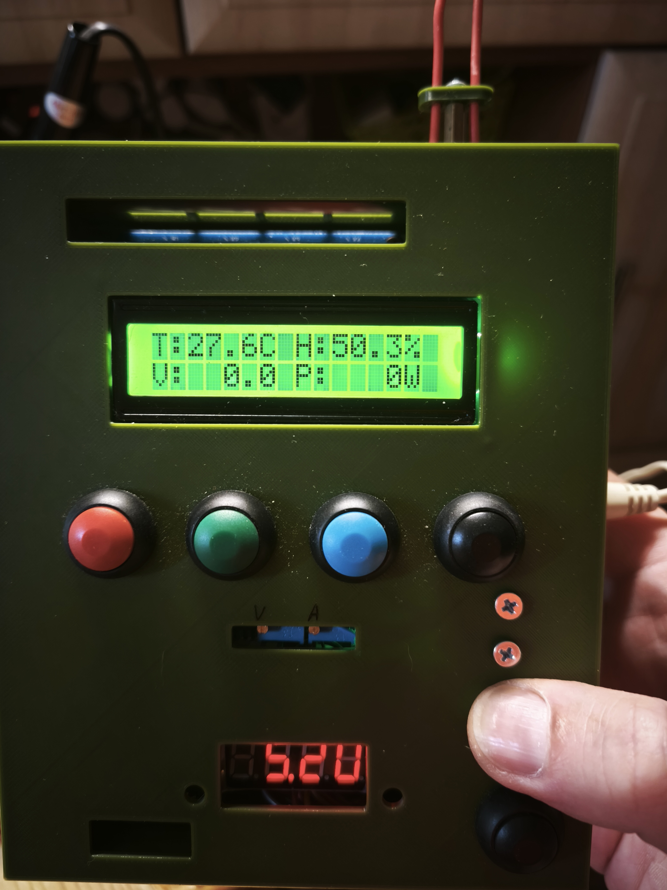
- 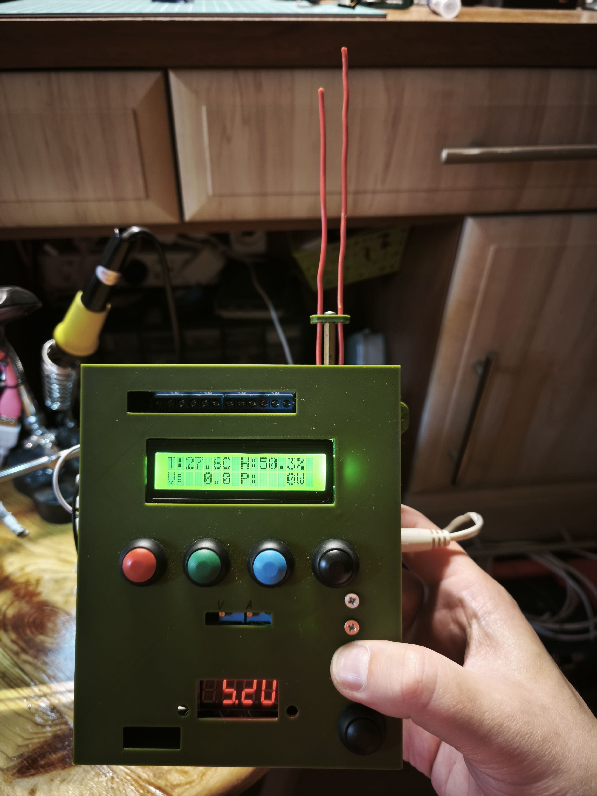
- 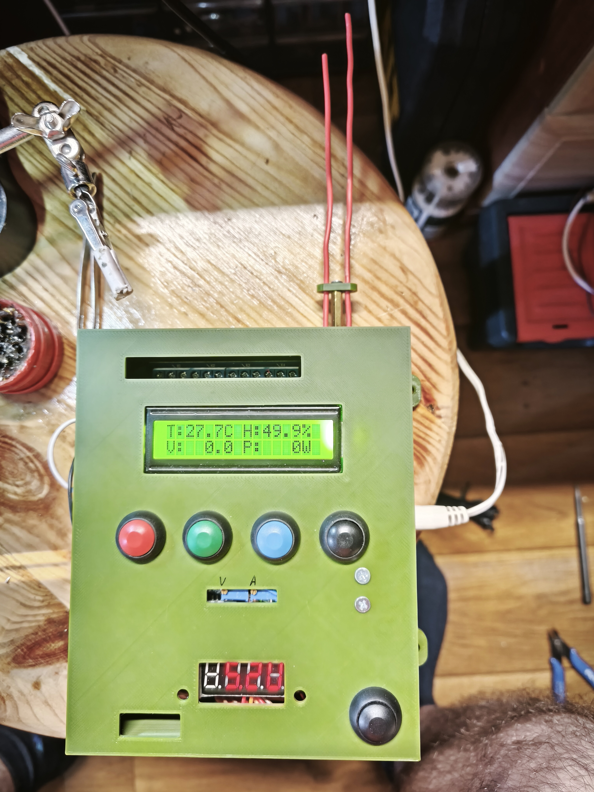
- 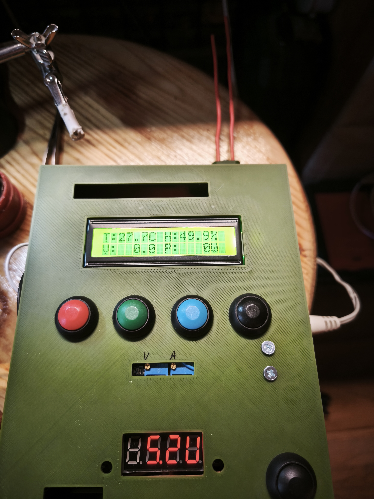
- 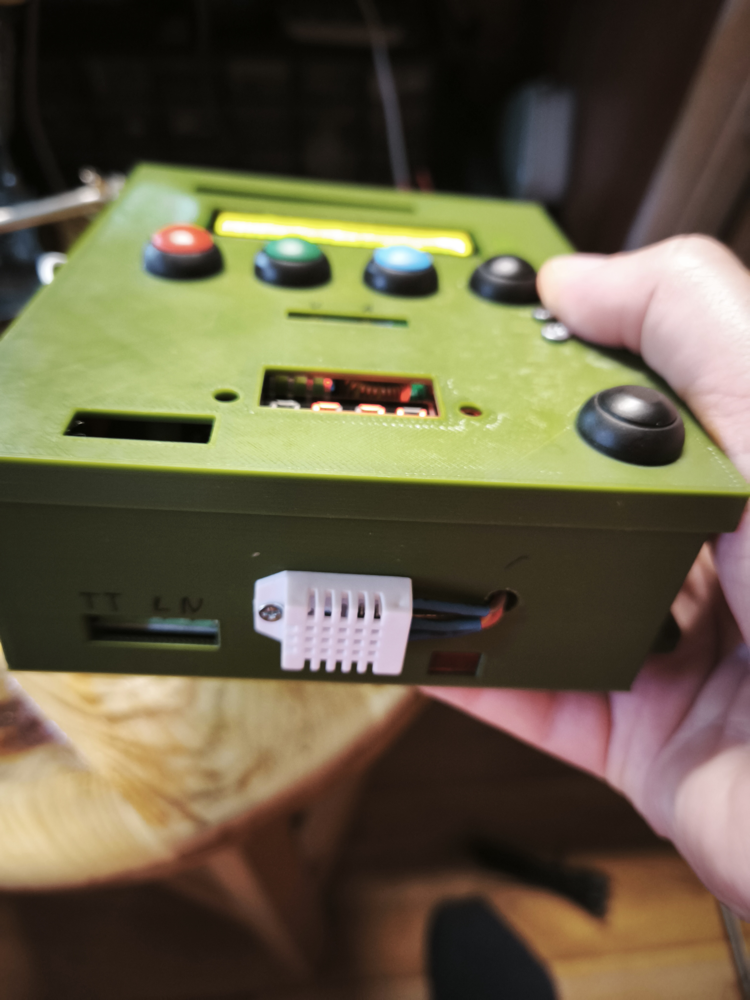
