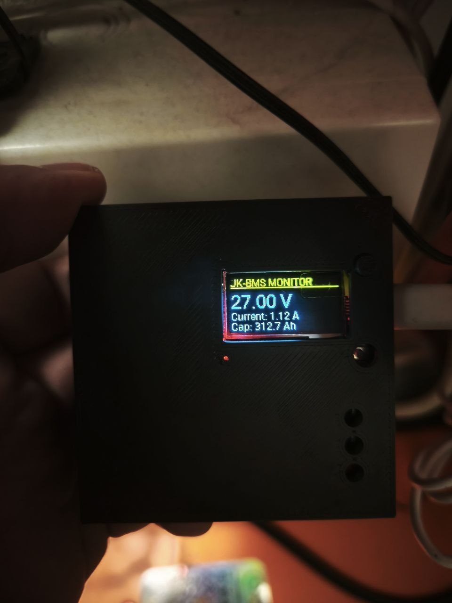
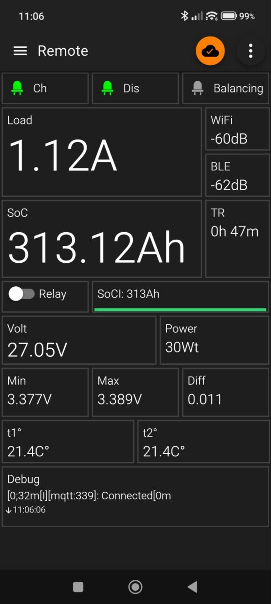

# JK-BMS to MQTT Bridge with ESP32 & OLED Display

This project provides a robust solution for monitoring a **JK-BMS (Jikong)** using an **ESP32**. It retrieves data via Bluetooth (BLE) and transmits it to a local **Mosquitto MQTT** broker. The device features an integrated **OLED display** with power-saving logic and a **physical relay** control based on State of Charge (SoC).

## 🚀 Features
*   **BLE Integration:** Direct connection to JK-BMS (optimized for `JK02_32S` protocol).
*   **Local MQTT:** High-speed data transmission to a local server with password authentication.
*   **Smart OLED Display:** Shows real-time Voltage, Current, and SoC. Auto-off after 30 seconds to prevent burn-in.
*   **Physical Control:** Use the **BOOT button** (GPIO0) to wake the screen.
*   **Relay Automation:** Automatically toggles a relay on GPIO14 based on battery capacity (On < 200Ah, Off > 300Ah).
*   **Intelligent Calculations:** Provides a "Charging Time Remaining" sensor in a human-readable format (e.g., "2h 15m").
*   **Signal Diagnostics:** Monitors Wi-Fi RSSI and BLE RSSI for connection troubleshooting.

---

## 🛠 Hardware Requirements
*   **Microcontroller:** ESP32 Ideaspark with integrated 0.96" OLED (SSD1306 128x64).
*   **BMS:** JK-BMS (tested on model `JK_B2A8S20P`).
*   **Relay:** 5V Opto-isolated relay module connected to GPIO14.
*   **Power:** Reliable 5V USB power supply.

---

## 🖥 Mosquitto MQTT Broker Setup (Windows)

To keep the system local and fast, Mosquitto is installed on a Windows PC.

### 1. Installation & User Creation
1. Download and install [Mosquitto for Windows](https://mosquitto.org/download/).
2. Open **Command Prompt (CMD)** as **Administrator**.
3. Create a password file and add a user (e.g., `yura`):
   ```cmd
   cd "C:\Program Files\mosquitto"
   mosquitto_passwd -c C:/mosquitto/passwords.txt yura
   ```
4. Enter your desired password when prompted.

### 2. Configure `mosquitto.conf`
Edit the configuration file (usually in `C:\Program Files\mosquitto\mosquitto.conf`). Add the following lines at the very end (avoid quotes if there are no spaces in the path):
```text
listener 1883
allow_anonymous false
password_file C:/mosquitto/passwords.txt
```

### 3. Windows Firewall & Permissions
*   **Firewall:** Create an "Inbound Rule" for **TCP port 1883** to allow the ESP32 to connect.
*   **File Permissions:** Right-click the `C:\mosquitto\passwords.txt` file -> Properties -> Security -> Edit -> Add. Type `SYSTEM` and `NETWORK_SERVICE` and grant "Full Control" to ensure the service can read the password file.
*   **Restart Service:** Open `services.msc`, find **Mosquitto Broker**, and restart it.

---

## 🔨 Installation & Compilation

To compile this project and flash it to your ESP32, you will need to set up an ESPHome environment on your Windows PC.

### 1. Install Python
*   **Recommended Version:** [Python 3.12.x](https://www.python.org/downloads/windows/) (Stable).
*   **Warning:** Avoid Python 3.13 for now, as it has compatibility issues with the `littlefs` library used in this project.
*   **Important:** During installation, make sure to check the box **"Add Python to PATH"**.

### 2. Install ESPHome
Open **Command Prompt (CMD)** and run the following command:
```cmd
pip install esphome
```

### 3. Prepare the Project Folder
1. Create a folder (e.g., `C:\esp_jkbms`).
2. Place your `jkbms.yaml` and `secrets.yaml` files inside this folder.
3. If you previously tried to compile with an incorrect Python version, delete the hidden folder `C:\Users\YourUser\.platformio` to ensure a clean build environment.

### 4. Compile and Flash
1. Connect your ESP32 to the PC via USB.
2. In the Command Prompt, navigate to your folder:
   ```cmd
   cd C:\esp_jkbms
   ```
3. Run the compilation and flash command:
   ```cmd
   esphome run jkbms.yaml
   ```

### What happens during this process:
*   **First Run:** ESPHome will download the required toolchains, the `esp-idf` framework, and the JK-BMS external components from GitHub. This can take **5–15 minutes** depending on your internet speed and CPU.
*   **Subsequent Runs:** Only changes are compiled, making the process much faster (under 1 minute).
*   **OTA (Over-The-Air):** After the first successful flash via USB, you can update the device over Wi-Fi. ESPHome will automatically detect the device on your network and offer to flash it wirelessly.

### Logs Monitoring
Once flashing is complete, the console will automatically switch to **Log View**. You can also view logs at any time without reflashing by running:
```cmd
esphome logs jkbms.yaml
```
Look for `[I][mqtt:339]: Connected` to confirm the link to your Mosquitto broker is active.

---

### Suggested Project Folder Structure:
```text
C:\esp_jkbms\
├── jkbms.yaml      <-- Main configuration
└── secrets.yaml    <-- WiFi, MQTT, and Telegram credentials
```

---

## ⚙️ ESPHome Configuration

### 1. `secrets.yaml`
Store your credentials securely in a separate file:
```yaml
wifi_ssid: "Your_SSID"
wifi_password: "Your_WiFi_Password"
mqtt_username: "yura"
mqtt_password: "Your_MQTT_Password"
mqtt_broker: "192.168.1.50"
```

### 2. Main YAML Highlights
Use `substitutions` at the top of your file for easy hardware management:

```yaml
substitutions:
  device_name: jkbms-gateway-v2
  bms_mac_address: "C8:47:80:28:71:3E"
  relay_control_pin: "14"
  display_on_time: "30s"
  bms_update_interval: "5s"
  total_capacity: "314.0"
  soc_low_limit: "200.0"
  soc_high_limit: "300.0"

esphome:
  name: ${device_name}
  on_boot:
    priority: -100
    then:
      - script.execute: display_timer

esp32:
  board: esp32dev
  framework:
    type: esp-idf # Recommended for stable BLE + WiFi coexistence

wifi:
  ssid: !secret wifi_ssid
  password: !secret wifi_password
  manual_ip: #optional
    static_ip: 192.168.1.253
    gateway: 192.168.1.1
    subnet: 255.255.255.0
    dns1: 8.8.8.8 # Fixes DNS Resolve Errors

mqtt:
  broker: !secret mqtt_broker # Your PC IP Address
  username: !secret mqtt_username
  password: !secret mqtt_password
  port: 1883
  topic_prefix: jkbms

i2c:
  sda: 21 # Change to 5 if using older Ideaspark boards
  scl: 22 # Change to 4 if using older Ideaspark boards
  scan: true
```

---

## 📊 MQTT Topic Map
Configure your mobile app (MQTT Dash / Home Assistant) using these topics:

### Telemetry Sensors
| Topic | Description |
|---|---|
| `jkbms/voltage` | Total battery voltage (V) |
| `jkbms/current` | Pack current in Amps (+ charging, − discharging) |
| `jkbms/soc` | Remaining capacity (Ah) |
| `jkbms/power` | Pack power (W) |
| `jkbms/t1` | Temperature sensor 1 (°C) |
| `jkbms/t2` | Temperature sensor 2 (°C) |
| `jkbms/min_c_v` | Minimum cell voltage (V) |
| `jkbms/max_c_v` | Maximum cell voltage (V) |
| `jkbms/delta` | Cell delta voltage (V) |
| `jkbms/wifi_rssi` | Wi-Fi signal strength (dBm) |
| `jkbms/ble_rssi` | BLE signal strength from BMS (dBm) |
| `jkbms/charging_time_hours` | Estimated time until full charge (hours, numeric) |
| `jkbms/cycles` | BMS Charging Cycles |

### Binary / Status
| Topic | Description |
|---|---|
| `jkbms/status/charging` | Charging active (true/false) |
| `jkbms/status/discharging` | Discharging active (true/false) |
| `jkbms/status/balancing` | Balancer active (true/false) |

### Relay Control
| Topic | Description |
|---|---|
| `jkbms/relay/state` | Current relay status (ON/OFF) |
| `jkbms/relay/set` | **Command topic** — send ON/OFF to toggle relay |

### JK BMS Switches
| State Topic | Command Topic | Description |
|---|---|---|
| `jkbms/switch/charge/state` | `jkbms/switch/charge/set` | Charging enabled |
| `jkbms/switch/discharge/state` | `jkbms/switch/discharge/set` | Discharging enabled |
| `jkbms/switch/balance/state` | `jkbms/switch/balance/set` | Balancer enabled |

### Text Sensors / Diagnostics
| Topic | Description |
|---|---|
| `jkbms/errors` | BMS error codes / text |
| `jkbms/charging_time_human` | Formatted charging time (e.g. "2h 15m" or "NA") |

---

## 📷 Images





---

## 🛠 Troubleshooting
*   **Error 0x8006 (SSL Timeout):** Avoid using port 8883. Use port 1883 without TLS to save ESP32 resources.
*   **Voltage shows 0.000V:** Your BMS likely uses a 300-byte data packet. Ensure `protocol_version` is set to `JK02_32S`.
*   **Display Communication Failed:** Check your I2C pins in the log. If (21, 22) fails, try (5, 4).
*   **DNS Resolve Error:** This happens when the ESP32 cannot find the MQTT server name. Always use a `manual_ip` block with `dns1: 8.8.8.8`.
