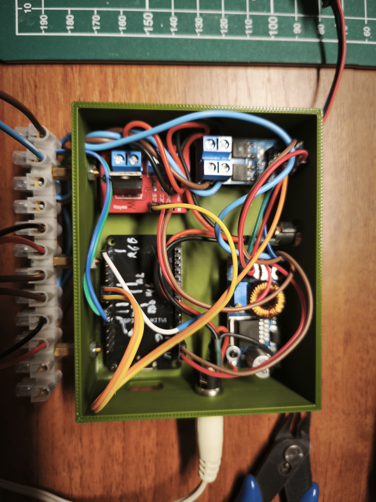
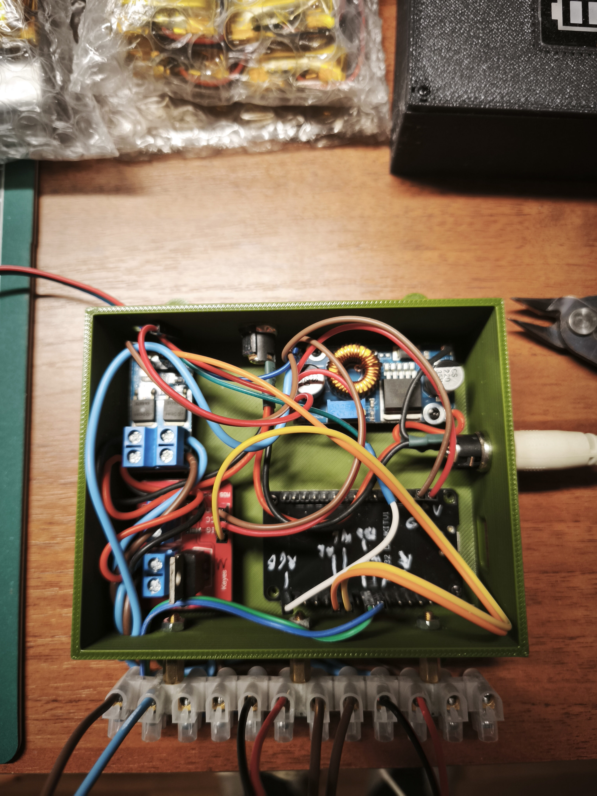
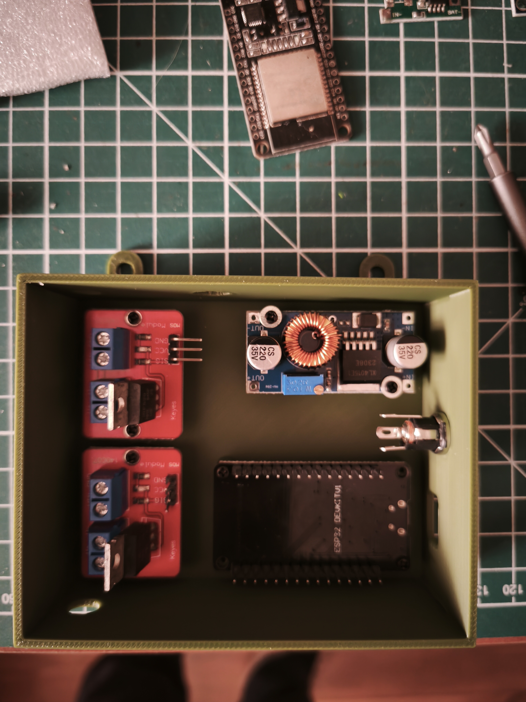

# WC Lights

An ESPHome-based smart lighting controller for WC and Bath rooms. Automatically manages lights based on door open/close events, detects user presence, supports day/night brightness modes, and drives an RGB status strip to signal occupancy and post-visit alerts.

---

## Home Assistant Views

| View 1 | View 2 | View 3 |
|--------|--------|--------|
|  |  |  |

---

## Images

| Assembly | Installed |
|----------|-----------|
|  |  |



---

## Features

- **Automatic light control** — lights turn on when the door opens, dim when the user is inside (based on time of day), and turn off when the user exits
- **Day / Night brightness** — configurable brightness levels for day and night per room, with a configurable night window (default 00:00–06:00)
- **Door open timeout** — if the door is left open longer than the configured timeout (default WC: 10 s, Bath: 20 s), the next door-close will turn the lights off
- **RGB status strip** — shows WC occupancy color (default: Red) and plays a post-visit flash (default: Yellow, 30 s) for both rooms independently
- **Visit statistics** — tracks time spent inside, last visit duration, and maximum visit duration per room; all values persist across reboots
- **Endstop mode** — supports both NC and NO door switches, configurable per room from Home Assistant
- **Reset counters** — hardware button (GPIO) and Home Assistant button to reset all visit counters
- **Captive portal + Web server** — works without Wi-Fi; GPIO logic is fully independent of network connectivity
- **OTA updates** — supports ESPHome OTA

---

## Hardware

| Component | Description |
|-----------|-------------|
| ESP32 dev board | Main controller (esp32dev) |
| 2× MOSFET module | PWM dimming for WC and Bath main lights (LED/bulb) |
| WS2812B LED strip (5 V) | RGB status strip (up to 50 LEDs configured) |
| 2× door endstop switch | Magnetic or mechanical, NO or NC |
| Push button | Hardware reset for visit counters |

### GPIO Pinout

| Signal | GPIO | Default |
|--------|------|---------|
| WC main light (MOSFET) | GPIO18 | — |
| Bath main light (MOSFET) | GPIO19 | — |
| WC door switch | GPIO16 | NC, pull-up |
| Bath door switch | GPIO17 | NC, pull-up |
| RGB status strip data | GPIO23 | — |
| Reset counters button | GPIO4 | active-low |

---

## 3D Printed Enclosure

Printable files are in the [`stl/`](stl/) folder:

| File | Description |
|------|-------------|
| `WC-Lights - Bottom.stl` | Bottom shell of the enclosure |
| `WC-Lights - Top.stl` | Top lid of the enclosure |
| `A1M WC-Lights.3mf` | Full project file for Bambu Studio (A1M, 0.4 mm nozzle) |

---

## Configuration

All settings are exposed via ESPHome substitutions in [`wc-lights.yaml`](wc-lights.yaml) for easy customisation without editing logic.

### Key substitutions

| Substitution | Default | Description |
|---|---|---|
| `wc_light_pin` | GPIO18 | WC light MOSFET pin |
| `bath_light_pin` | GPIO19 | Bath light MOSFET pin |
| `wc_door_pin` | GPIO16 | WC door sensor pin |
| `bath_door_pin` | GPIO17 | Bath door sensor pin |
| `rgb_strip_pin` | GPIO23 | RGB strip data pin |
| `reset_counters_pin` | GPIO4 | Hardware counter reset button |
| `wc_endstop_mode_default` | NC | WC switch mode (NC/NO) |
| `bath_endstop_mode_default` | NC | Bath switch mode (NC/NO) |
| `led_pwm_frequency` | 2000 Hz | MOSFET PWM frequency |
| `rgb_led_count` | 50 | Total compiled LED count |
| `rgb_default_active_led_count` | 26 | Active LEDs shown in HA |
| `rgb_order` | GRB | LED strip color order |
| `night_start_hour` / `night_start_minute` | 0:00 | Night mode start |
| `night_end_hour` / `night_end_minute` | 6:00 | Night mode end |
| `wc_day_brightness_pct` | 100 | WC day brightness % |
| `wc_night_brightness_pct` | 30 | WC night brightness % |
| `bath_day_brightness_pct` | 100 | Bath day brightness % |
| `bath_night_brightness_pct` | 30 | Bath night brightness % |
| `wc_open_timeout_seconds` | 10 | WC door-open timeout |
| `bath_open_timeout_seconds` | 20 | Bath door-open timeout |
| `wc_flashlight_duration_seconds` | 30 | WC post-visit flash duration |
| `bath_flashlight_duration_seconds` | 30 | Bath post-visit flash duration |

Copy `secrets.yaml.example` to `secrets.yaml` and fill in your Wi-Fi credentials before flashing.

---

## Home Assistant Entities

### WC

| Entity | Type | Description |
|--------|------|-------------|
| WC - Light | Light | Main WC light (dimmable) |
| WC - Door | Binary sensor | Door open/closed (device class: door) |
| WC - User Inside | Binary sensor | Occupancy (device class: occupancy) |
| WC - Time User Spent Inside | Sensor | Live timer while inside (s) |
| WC - Last Visit Duration | Sensor | Duration of last visit (s) |
| WC - Max Time User Inside | Sensor | Record longest visit (s) |
| WC - Day Brightness | Number | Day brightness (%) |
| WC - Night Brightness | Number | Night brightness (%) |
| WC - Door Open Timeout | Number | Timeout before exit-on-close (s) |
| WC - Post Visit Flash Duration | Number | RGB flash duration after visit (s) |
| WC - Status Strip Inside Brightness | Number | RGB strip brightness while occupied (%) |
| WC - Inside Color | Select | RGB color while user is inside |
| WC - Flash Color | Select | RGB color for post-visit flash |
| WC - Endstop Mode | Select | NC / NO switch type |

### Bath

Same set of entities as WC, prefixed with **Bath -**.

### Device (shared)

| Entity | Type | Description |
|--------|------|-------------|
| Device - Status Strip | Light | RGB strip (manual control + effects) |
| Device - Status Strip Length | Number | Active LED count (adjustable) |
| Device - Status Strip Flash Brightness | Number | Flash brightness (%) |
| Device - Night Start/End Hour/Minute | Number | Night window schedule |
| Device - WiFi RSSI | Sensor | Wi-Fi signal strength (diagnostic) |
| Device - Reset Visit Counters | Button | Resets all WC and Bath statistics |
| Device - Test Status Strip Rainbow | Button | Plays a 60 s rainbow test on the strip |
| Device - Reset WiFi and Device Settings | Button | Factory reset |
| Device - Restart Device | Button | Restarts the ESP32 |

---

## Light Logic

```
Door opens
  └─ Lights ON at day brightness
     └─ Door closes
           ├─ Door was open < timeout → User entered: lights dim (inside mode)
           │     └─ Door opens again → User exiting
           │           └─ Door closes → Lights OFF + post-visit RGB flash
           └─ Door was open ≥ timeout → Lights OFF (nobody entered)
```

Night mode reduces brightness automatically between `night_start` and `night_end`.

---

## Flashing

```bash
esphome run wc-lights.yaml
```

On first flash use USB. Subsequent updates use OTA over Wi-Fi.
