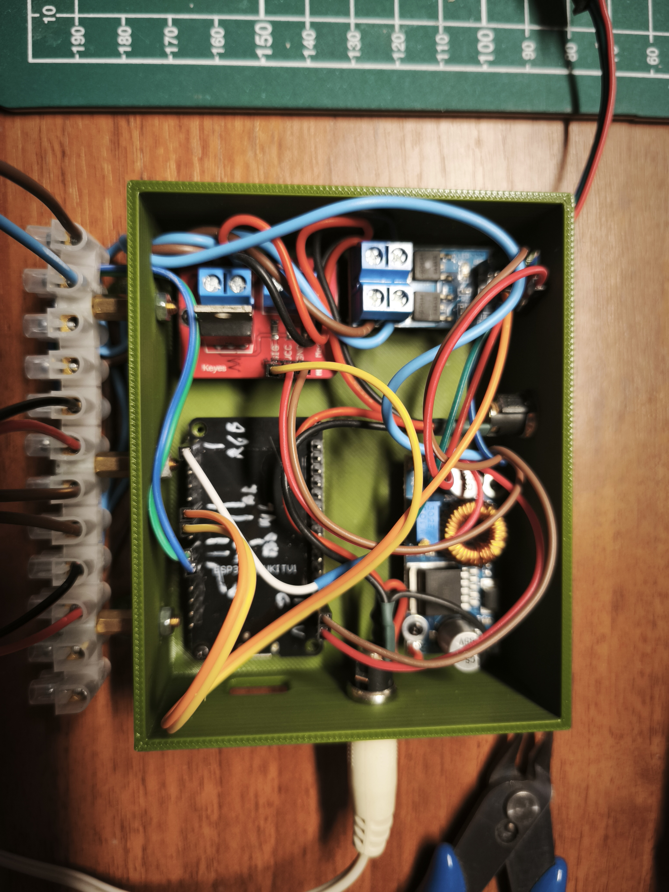
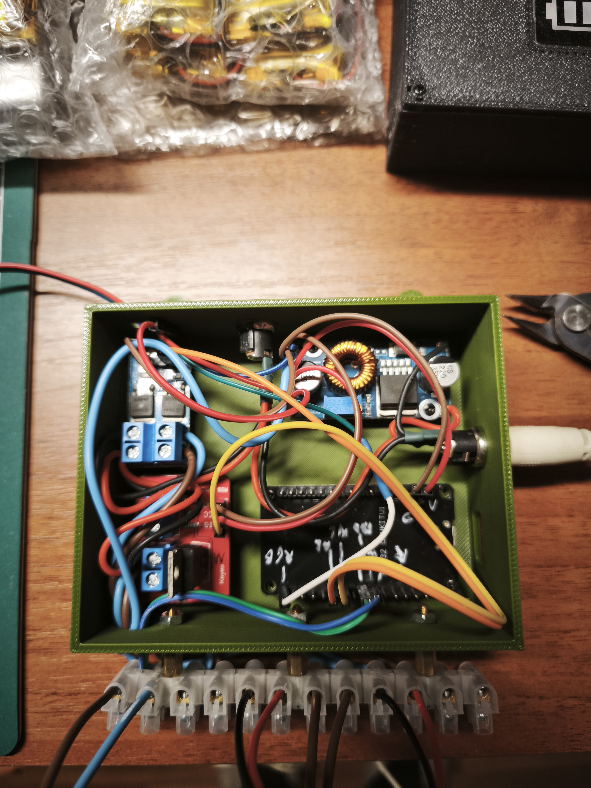
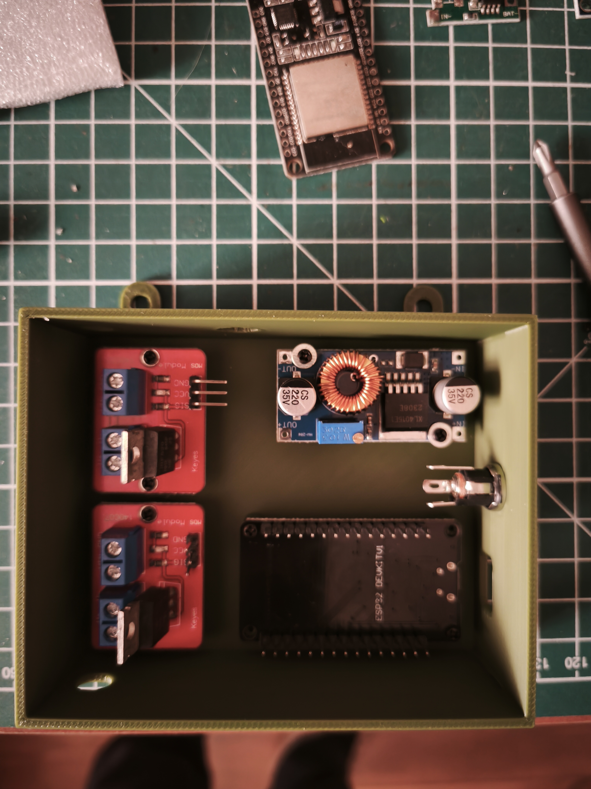

# WC Lights

An ESPHome-based smart lighting controller for WC and Bath rooms. Automatically manages lights based on door open/close events, detects user presence, supports day/night brightness modes, and drives an RGB status strip to signal occupancy and post-visit alerts.

---

## Home Assistant Views

| View 1 | View 2 | View 3 |
|--------|--------|--------|
|  |  |  |

---

## Images

| Assembly | Installed |
|----------|-----------|
|  |  |



---

## Features

- **Automatic light control** — lights turn on when the door opens, dim when the user is inside (based on time of day), and turn off when the user exits
- **Day / Night brightness** — configurable brightness levels for day and night per room, with a configurable night window (default 00:00–06:00)
- **Door open timeout** — if the door is left open longer than the configured timeout (default WC: 10 s, Bath: 20 s), the next door-close will turn the lights off
- **RGB status strip** — shows WC occupancy color (default: Red) and plays a post-visit flash (default: Yellow, 30 s) for both rooms independently
- **WC inside blink reminder** — while WC is occupied, the main WC light can blink periodically with configurable interval and blink count
- **Visit statistics** — tracks visit count, time spent inside, last visit duration, and maximum visit duration per room; all values persist across reboots
- **Endstop mode** — supports both NC and NO door switches, configurable per room from Home Assistant
- **Reset counters** — hardware button (GPIO) and Home Assistant button to reset all visit counters
- **Captive portal fallback** — web server is disabled by default; GPIO logic is fully independent of network connectivity
- **OTA updates** — supports ESPHome OTA

---

## Hardware

| Component | Description |
|-----------|-------------|
| ESP32 dev board | Main controller (esp32dev) |
| 2× MOSFET module | PWM dimming for WC and Bath main lights (LED/bulb) |
| WS2812B LED strip (5 V) | RGB status strip (up to 50 LEDs configured) |
| 2× door endstop switch | Magnetic or mechanical, NO or NC |
| Push button | Hardware reset for visit counters |

### GPIO Pinout

| Signal | GPIO | Default |
|--------|------|---------|
| WC main light (MOSFET) | GPIO18 | — |
| Bath main light (MOSFET) | GPIO19 | — |
| WC door switch | GPIO21 | NC, pull-up |
| Bath door switch | GPIO22 | NC, pull-up |
| RGB status strip data | GPIO23 | — |
| Reset counters button | GPIO4 | active-low |

---

## Troubleshooting: ESP32 Instability / Reboots

If the ESP32 resets randomly or dies after days of uptime while driving the WS2812 status strip, this is almost always an electrical wiring issue, not a timing/frequency setting — `led_pwm_frequency` only controls the two `ledc` MOSFET dimmer outputs (WC/Bath main lights); the WS2812 strip is bit-banged by the ESP32's RMT peripheral with fixed protocol timing and is not affected by that substitution at all.

Root causes to check, in order of likelihood, when the strip runs off its own 5 V supply:

1. **Ground topology** — a common ground between the ESP32 supply and the strip's 5 V supply is required, but *how* they're tied matters. If both grounds are daisy-chained through a shared screw terminal that also carries the MOSFET load return current, switching current pulses (LED strip draws up to ~3 A at full brightness/50 LEDs; MOSFET PWM loads switch at `led_pwm_frequency`) create ground bounce on that shared path, which is seen by the ESP32 as noise on its own GND reference — this is a well-known cause of brownout resets. Fix: wire the ESP32 GND, LED strip GND, and PSU GND in a **star** topology (one single junction point), not daisy-chained through the load return paths.
2. **Bulk capacitance at the strip** — a large electrolytic capacitor (1000 µF, 6.3 V+) should sit directly across **V+ and GND at the start of the LED strip itself** (not on the data line, and not only back at the PSU). This absorbs the strip's current transients locally instead of pulling them through the wiring.
3. **Level shifting** — the data line currently runs the ESP32's 3.3 V logic straight into a 5 V WS2812 strip (with the 330 Ω series resistor, which is correctly sized). This is out of spec for `VIH` on 5 V strips and works "most of the time," but marginal signal levels are more sensitive to the noise from point 1. Adding a 74AHCT125/74HCT245 level shifter between the ESP32 GPIO and the strip's DIN meaningfully improves margin, especially over the current 50-LED run.
4. **Decoupling at the ESP32** — add a 100 nF ceramic + 100–470 µF electrolytic capacitor across the ESP32's own 3.3 V/GND right at the board, close to the XL4015 buck output, to absorb WiFi TX current spikes (~500 mA bursts) that are a separate, common cause of ESP32 brownout resets unrelated to the LED strip.

As a software-side mitigation, `wc-lights.yaml` lowers the ESP32 brownout detector trip threshold (`CONFIG_ESP32_BROWNOUT_DET_LVL_SEL_7`) so brief noise dips don't force a reset — but this only masks the symptom; items 1–4 above address the actual cause.

---

## 3D Printed Enclosure

Printable files are in the [`stl/`](stl/) folder:

| File | Description |
|------|-------------|
| `WC-Lights - Bottom.stl` | Bottom shell of the enclosure |
| `WC-Lights - Top.stl` | Top lid of the enclosure |
| `A1M WC-Lights.3mf` | Full project file for Bambu Studio (A1M, 0.4 mm nozzle) |

---

## Configuration

All settings are exposed via ESPHome substitutions in [`wc-lights.yaml`](wc-lights.yaml) for easy customisation without editing logic.

### Key substitutions

| Substitution | Default | Description |
|---|---|---|
| `wc_light_pin` | GPIO18 | WC light MOSFET pin |
| `bath_light_pin` | GPIO19 | Bath light MOSFET pin |
| `wc_door_pin` | GPIO21 | WC door sensor pin |
| `bath_door_pin` | GPIO22 | Bath door sensor pin |
| `rgb_strip_pin` | GPIO23 | RGB strip data pin |
| `reset_counters_pin` | GPIO4 | Hardware counter reset button |
| `wc_endstop_mode_default` | NC | WC switch mode (NC/NO) |
| `bath_endstop_mode_default` | NC | Bath switch mode (NC/NO) |
| `led_pwm_frequency` | 2000 Hz | MOSFET PWM frequency |
| `rgb_led_count` | 50 | Total compiled LED count |
| `rgb_default_active_led_count` | 26 | Active LEDs shown in HA |
| `rgb_order` | GRB | LED strip color order |
| `night_start_hour` / `night_start_minute` | 0:00 | Night mode start |
| `night_end_hour` / `night_end_minute` | 6:00 | Night mode end |
| `wc_day_brightness_pct` | 100 | WC day brightness % |
| `wc_night_brightness_pct` | 30 | WC night brightness % |
| `bath_day_brightness_pct` | 100 | Bath day brightness % |
| `bath_night_brightness_pct` | 30 | Bath night brightness % |
| `wc_open_timeout_seconds` | 10 | WC door-open timeout |
| `bath_open_timeout_seconds` | 20 | Bath door-open timeout |
| `wc_flashlight_duration_seconds` | 30 | WC post-visit flash duration |
| `bath_flashlight_duration_seconds` | 30 | Bath post-visit flash duration |

Copy `secrets.yaml.example` to `secrets.yaml` and fill in your Wi-Fi credentials before flashing.

---

## Home Assistant Entities

### WC

| Entity | Type | Description |
|--------|------|-------------|
| WC - Light | Light | Main WC light (dimmable) |
| WC - Door | Binary sensor | Door open/closed (device class: door) |
| WC - User Inside | Binary sensor | Occupancy (device class: occupancy) |
| WC - Time User Spent Inside | Sensor | Live timer while inside (s) |
| WC - Visit Count | Sensor | Total number of completed WC visits |
| WC - Last Visit Duration | Sensor | Duration of last visit (s) |
| WC - Max Time User Inside | Sensor | Record longest visit (s) |
| WC - Day Brightness | Number | Day brightness (%) |
| WC - Night Brightness | Number | Night brightness (%) |
| WC - Door Open Timeout | Number | Timeout before exit-on-close (s) |
| WC - Post Visit Flash Duration | Number | RGB flash duration after visit (s) |
| WC - Inside Blink Reminder Interval | Number | Minutes between periodic WC reminder blinks while occupied |
| WC - Inside Blink Reminder Count | Number | Number of blink cycles per WC reminder |
| WC - Status Strip Inside Brightness | Number | RGB strip brightness while occupied (%) |
| WC - Inside Color | Select | RGB color while user is inside |
| WC - Flash Color | Select | RGB color for post-visit flash |
| WC - Endstop Mode | Select | NC / NO switch type |
| WC - Test Inside Blink Reminder | Button | Runs WC blink reminder sequence immediately |

### Bath

Same core set of entities as WC, prefixed with **Bath -**, including **Bath - Visit Count**.
WC-only entities are the inside blink reminder controls and test button.

### Device (shared)

| Entity | Type | Description |
|--------|------|-------------|
| Device - Status Strip | Light | RGB strip (manual control + effects) |
| Device - Status Strip Length | Number | Active LED count (adjustable) |
| Device - Status Strip Flash Brightness | Number | Flash brightness (%) |
| Device - Night Start/End Hour/Minute | Number | Night window schedule |
| Device - WiFi RSSI | Sensor | Wi-Fi signal strength (diagnostic) |
| Device - Reset Visit Counters | Button | Resets all WC and Bath statistics |
| Device - Test Status Strip Rainbow | Button | Plays a 60 s rainbow test on the strip |
| Device - Reset WiFi and Device Settings | Button | Factory reset |
| Device - Restart Device | Button | Restarts the ESP32 |

---

## Light Logic

```
Door opens
  └─ Lights ON at day brightness
     └─ Door closes
           ├─ Door was open < timeout → User entered: lights dim (inside mode)
           │     └─ Door opens again → User exiting
           │           └─ Door closes → Lights OFF + post-visit RGB flash
           └─ Door was open ≥ timeout → Lights OFF (nobody entered)
```

Night mode reduces brightness automatically between `night_start` and `night_end`.

When WC is occupied, a periodic reminder can blink the WC main light based on `WC - Inside Blink Reminder Interval` and `WC - Inside Blink Reminder Count`.

---

## Flashing

```bash
esphome run wc-lights.yaml
```

On first flash use USB. Subsequent updates use OTA over Wi-Fi.
